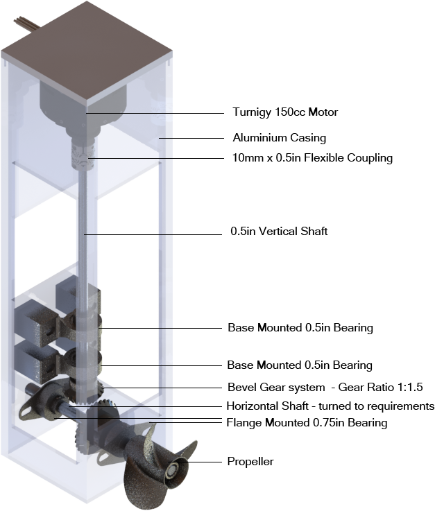
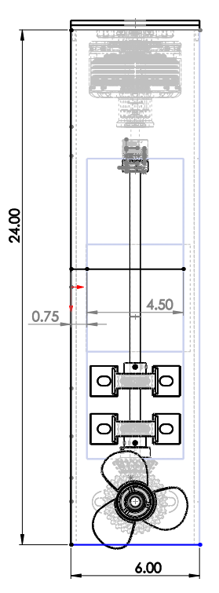
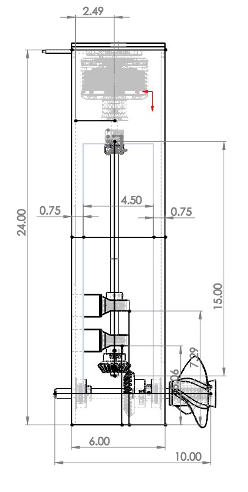

<Callout type="info">
This post is a condensed, technical summary of our team's end-of-project report for the SUTD-MIT Global Leadership Programme, with personal details removed.
</Callout>

On race day our hydrofoil boat gained a few inches of lift off the Charles River — then the motor shaft coupling snapped, ending the run.

In the summer of 2017, we spent 10 weeks at Cambridge, Massachusetts under the SUTD-MIT Global Leadership Programme, teaming up with MIT students at the MIT International Design Centre (IDC). The challenge was to build a fully functional single-passenger electric boat from scratch. The boat had to float, advance at reasonable speed on the Charles River, fit inside the IDC freight elevator, and be transportable to the MIT Sailing Pavilion. Each team received two 40 lb 12V lead-acid batteries and a range of motors and propellers to choose from.

Our team settled early on a hydrofoil boat — wing-shaped foils mounted beneath the hull to generate lift at speed. We defined success as achieving any measurable lift from the foils, however small. Full flight (hull clearing the water) was the stretch goal. We built two fiberglass-strengthened foam hydrofoils attached by metal struts to a wooden hull, powered by a 24V outboard electric drivetrain with bevel gears.

## In this post

- Design process: brainstorming, hull evolution from catamaran to single body, and hydrofoil shape selection
- Outboard drivetrain engineering and electronics setup
- Engineering calculations: waterline, centre of gravity, drag, and thrust
- Hull, drivetrain, and hydrofoil fabrication and assembly
- Evaluation of results and future recommendations

# Design

## Design Process

The design process began with an hour-long unconstrained brainstorming session on paper, producing a range of roughly free-handed boat ideas. Each team member then chose four to refine into detailed sketches.

*Some of our 'very refined' boat designs:*

We sorted these into four categories: animal-inspired, traditionally used, paddle-propelled, and air-propelled. Research showed propellers are far more efficient than paddles, so all paddle designs were eliminated. Remaining designs were scored on a Pugh chart evaluating feasibility, speed potential, learning value, and coolness.

We couldn't decide between hydrofoils and a catamaran, so we decided to build a catamaran with hydrofoils.

*Sketch of chosen design — catamaran with hydrofoils:*

## Hull: From Catamaran to Single Body

We initially opted for two separate wooden hulls connected by three struts — two wooden, one aluminium to hold the weight of a seat and driver at its centre.

To fit the freight elevator, the catamaran was constrained to 7'10" long by 6'5" wide. Since drag increases sharply when bow/stern wavelength approaches hull length, we maximised length at 7'5" (leaving 5" of leeway for the rudder and elevator doors). Width was set at 5'5" for stability — the wide spacing lets the hulls exert significant righting torque after disturbances.

*Detailed sketch of catamaran with hydrofoils:*

Individual hulls were kept narrow (1'6" wide) to minimise wetted surface area. Each hull converged to a vertical edge at the front, piercing through water to reduce drag. The backs were kept flat to increase volume and lower the waterline.

However, two smaller hulls would take roughly twice as long to ShopBot, epoxy, and fibreglass. The three-strut connection was also structurally questionable — prone to twisting and separation. Since our priority was the hydrofoils, we couldn't afford the time cost of a catamaran and switched to a single hull.

*CAD model of single hull boat:*

The replacement was a 7' long, 4' wide flat-bottomed hull. We decreased length by 5" since the single-hull drivetrain sits on the back. Width was reduced since it now contributes directly to drag (unlike the catamaran's empty space between hulls). The flat bottom was chosen purely for fabrication speed — a clear optimisation point for future iterations.

*Dimensional drawing of boat hull:*

Each hydrofoil had 30-degree upward slants, so we designed the hull sides at the same angle — making the strut-to-hull connection perpendicular on both surfaces, allowing commercial right-angle brackets.

We minimised the flat bottom width to reduce drag. The pilot's hip width (estimated at 1') set the minimum, and the 4' total width combined with 30-degree side walls determined wall height and width geometrically.

The hull tip was pointed (three triangular pieces converging to a point) to minimise drag, matching the catamaran design intent. The back was filled by a trapezoid perpendicular to the bottom flat piece so the drivetrain could mount vertically. Additional inward-angling top pieces added freeboard and acted as a partial splash cover.

## Hydrofoil Shape

Hydrofoils work like airplane wings but mounted beneath the hull. Water hitting the front of a tilted, curved foil is deflected downward; the resulting pressure differential (higher pressure below, lower above) generates upward lift.

We placed two large hydrofoils — one near the front, one near the back — each spanning the full hull width to maximise lift area. The main design choice was the overall layout shape:

1. **Straight** — flat horizontal foils maximise vertical lift, but once they clear the surface, all lift is lost abruptly. Rough ride, potential damage.
2. **V-shaped** — lift is lost gradually as the waterline moves down the V, creating a self-correcting mechanism. Smoother ride, but less vertical lift due to the slant.
3. **Rounded V** — best of both worlds, but too difficult and time-consuming to fabricate.

*Various foil designs:*

We compromised: a flat centre piece with 30-degree slanted pieces on either side, mimicking a rounded V while being far easier to construct from straight pieces. The length of each sub-foil was determined in CAD by positioning 1' aluminium struts perpendicular to hull and foil surfaces, then removing overlap and overhang.

*Final hydrofoil design:*

*CAD model of hydrofoils:*

We used the H105 hydrofoil profile from [airfoiltools.com](http://airfoiltools.com), optimised for low-velocity water (low Reynolds number). At our target velocity of 6.35 knots, standard concerns like cavitation were minimal. Details on the H105: [Hydrofoil Section Design (PDF)](https://www.scribd.com/document/366647725/hysecdes).

Lift calculations were approximated using a [spreadsheet tool](http://www.perotto.org/Elia/libro1/lift.xls). Hydrofoil angles were set at 5 degrees (front) and 4 degrees (back) to ensure front-first lifting as a safety consideration.

## Outboard Drivetrain

The propeller had to sit deeper than the hull to maintain speed during flight. With the initial catamaran design, we considered twin propellers (one per hull) but this doubled cost, required synchronisation, and forced a motor downgrade. A single drivetrain hung between hulls was deemed unwieldy due to torque bracing requirements.

After switching to a single hull, we considered a slanted drivetrain (like a Vietnamese fishing boat) but rejected it — excessive shaft torque, weight, and inefficiency. A long vertical shaft extending below the foils was next, briefly planned to double as a foil support, but we didn't want a hole that size in the hull. We settled on an outboard motor.

*CAD model of drivetrain — front and side views:*

The aluminium casing had windows cut for weight reduction and assembly access. Casing height was set by foil depth so the propeller stays submerged during flight.

The drivetrain uses a bevel gear system (1.5:1 ratio, closest available to the calculated 1.72). The motor mounts vertically and connects via a clamped shaft coupling to a vertical shaft held by two bearings, with the small bevel gear at its end. This drives the larger gear on the horizontal shaft, which carries the propeller.

Ball bearings on both shafts prevent misalignment from gear forces. The vertical shaft uses base-mounted bearings on wood blocks; the horizontal shaft uses flange-mounted bearings flush with the casing walls. Bearings were placed close to the gears for maximum effectiveness against shaft deflection.

Shaft diameters were chosen based on bevel gear and propeller bore dimensions, converting between metric gears and imperial shaft stock. Shafts were turned down to specification, with press-fits for the gears.

## Electronics Setup

In the simplest case, only a motor and 24V are wired in series — but this gives only full-power operation. A potentiometer, throttle, and motor controller (MC) convert physical throttle twist into variable voltage, controlling motor speed. A DC/DC converter steps 12V from one battery down to 5V for the potentiometer.

Safety components:
- **Fuse** (100A) — melts to break the circuit on a short
- **Emergency switch** — breaks the circuit, but current can still arc briefly
- **Contactor** — contains a solenoid that holds a metal piece in place to complete the main circuit. When the emergency switch is hit, the weakened current drops the magnetic field, and the metal piece instantly falls, breaking the circuit
- **Precharge switch** — in series with a 10K resistor, turned on briefly when batteries are first connected to protect the motor controller's capacitor from inrush current. Turned off once the main switch (no resistor, full current) is engaged

The two batteries, fuse, contactor, main switch, and motor controller are in series. The precharge switch and resistor are in parallel with the main switch.

The contactor has four leads: two large (main circuit) and two small (emergency switch loop, 12V only). The small power lead connects to the 24V main circuit, and the small ground lead connects through the emergency switch to the 12V battery ground — creating a 12V potential difference. The DC/DC converter taps the same 12V from these small leads.

## Rudder

We started with a traditional design: a rectangular fin on a vertical 2x4, connected to a horizontal piece the driver pushes sideways, resting on a lazy susan atop the drivetrain.

*Photo and CAD model of initial rudder design:*

Testing revealed this forced the driver to reach uncomfortably far back. We modified the design with a parallelogram-shaped birch piece and a horizontal plank extending to the driver's right side.

*CAD model of modified rudder design:*

During the first Charles River test, this rudder exerted considerable torque on the lazy susan, though it remained functional. A final redesign used a U-shaped bracket encircling the drivetrain, with two hollow-pipe handles (one glued to the rudder, another bolted loosely to the first). The rudder itself was a birch frame covered in okoume, treated only with polyurethane rather than fibreglass, and positioned with less area behind the propeller.

*CAD model of final rudder design:*

# Calculations

## Waterline

With all hull and drivetrain masses accounted for, total mass was 315 lb, giving a waterline of 4.29" from the bottom of the boat. Overall hull height was 15.4", leaving 11.11" of clearance. The diverging hull shape provides a large safety factor — at 2x load (630 lb), the waterline only rises to 8.29" with 7.11" clearance.

*Side view of boat with expected waterline:*

*Calculated component masses:*

| Component       | Material          | Mass Density (lb/ft3) | Mass Volume (in3)     | Mass Volume (ft3)     | Mass (lb) | Count | Net Weight (lb) |
| --------------- | ----------------- | --------------------- | --------------------- | --------------------- | --------- | ----- | --------------- |
| Hydrofoil       | Fiberglassed Foam | 1.804                 | 554                   | 0.3206                | 0.578     | 6     | 3.47            |
| Aluminum Struts | Aluminum          | —                     | Included in Hydrofoil | Included in Hydrofoil | 10.09     | 1     | 10.09           |
| Hull (Okoume)   | Okoume            | 27                    | 1068.5                | 0.618                 | 16.69     | 1     | 16.69           |
| Hull (Birch)    | Birch             | 42                    | 984.68                | 0.570                 | 23.93     | 1     | 23.93           |
| Drivetrain      | Metals            | —                     | 159.48                | 0.092                 | 25        | 1     | 25              |
| Person          | —                 | —                     | —                     | —                     | 135       | 1     | 135             |
| Battery         | —                 | —                     | —                     | —                     | 43        | 2     | 86              |
| Rudder          | Wood              | —                     | —                     | —                     | 15        | 1     | 15              |
|                 |                   |                       |                       |                       |           |       | **315.19**      |

## Centre of Gravity

Most components are symmetrical, so the CG is centred on the Z-axis. With drivetrain and battery placements, the overall CG was calculated at 3.98" from the hull bottom (Y-axis) and 18.54" from the back (X-axis). This places the CG between the two hydrofoil lifting points — critical for stability during flight.

*CAD model with CG labelled:*

## Drag

*Resistance vs speed/length ratio for standard hull profile:*

From the calculated waterline, the waterline length was approximately 74.3". Using the resistance–speed/length ratio graph (for a standard hull profile, noting our flat-bottomed hull differs), we set the speed ratio at the graph maximum of 2.4, giving a hull speed of 5.9 knots and a total resistance of 210 lb/ton. Multiplying by boat weight yielded a drag power of approximately 1016W.

## Thrust

At 24V, 100A, and motor efficiency of 0.877 (per datasheet), motor power is 2.1 kW — comfortably exceeding the ~1 kW drag power. This confirmed the boat could theoretically reach the 6.22 knots required for hydrofoil lift.

# Fabrication

## Hull Cutting and Assembly

Stress tests in SolidWorks identified high-stress regions: the flat bottom, trapezoidal back, and triangular centre bottom of the prow were cut from 1/2" birch. Lower-stress regions used 1/8" okoume.

Three 1/2" birch ribs were added across the hull at 10", 50", and 57" from the back. Rounded shapes were cut from these solid ribs to reduce weight. Hydrofoil attachment points were identified as high-torque areas, so lengthwise birch struts were sanded and added between the back and middle ribs.

*ShopBot arrangements for hull (birch top, okoume bottom):*

 

All hull pieces were flat, so exporting .dxf files from SolidWorks was straightforward. Three .ai files were created, each corresponding to a 4x8 sheet of wood (two okoume, one birch), and cut on the ShopBot.

The pieces were stitch-and-glued and fiberglassed. The differing thicknesses of birch and okoume required careful alignment to eliminate gaps. A splash cover was later ShopBotted and attached to the hull via bolts through small wood blocks epoxied to the ribs.

## Drivetrain and Rudder Attachment

**Metal Casing** — Windows were milled on three sides to minimise weight. Holes were drilled for bearing mounts, motor wiring, propeller shaft, bearing attachment, hull mounting, and acrylic windows. The motor was screwed in, bearings bolted on, and hull connection bolted. Windows were held with small screws (Threadlocker Blue on the inside, double nuts on the outside) for removable access.

**Lid** — The motor mounts to the lid. Corresponding holes were milled. During attachment to the casing, all screw heads broke off — likely from insufficiently deep tapped holes.

**Shafts/Gears/Propeller** — Multiple fabrication issues arose from parts arriving off-specification.

The propeller bore was measured with slightly tilted callipers, giving an inaccurate reading. The first shaft was turned down too far for a press-fit and had to be redone. The second shaft was steel (aluminium was unavailable), which we later realised couldn't be tapped for a stronger gear attachment. Threadlocker Blue compensated adequately. The propeller was press-fitted using a heat press (necessary for the steel shaft).

The vertical motor shaft went through three iterations:
1. **First:** bearing bores were not actually 0.5" as specified — the shaft was turned too thin for the coupling.
2. **Second:** correct dimensions, but the aluminium shaft bent during gear press-fit.
3. **Third:** successful press-fit with a set screw added for the slightly loose fit. During the Charles River test, this set screw sheared from insufficient thickness. The subsequent iteration used a thicker set screw with a tapped pocket in the shaft, reinforced with Threadlocker Blue.

**Splash Guard** — Designed in SolidWorks, laser-cut from extruded acrylic, and attached to the drivetrain windows via L-brackets.

**Lazy Susan** — A spacer with clearance holes for the motor's M6 screw heads was made and drilled/tapped through the lid. The susan was installed and removed at the docks (the rudder couldn't fit in the elevator). Installation required two people: one to drill, one to hold and rotate the rudder to align blocked holes.

**Assembly** — Motor, lid, spacer, bearings, lazy susan, and windows were assembled with their respective bolts. Bearings were adjusted for vertical shaft alignment before bolting down. After a successful no-propeller test, the horizontal shaft was removed, the propeller press-fitted, and the lower drivetrain reassembled. The complete drivetrain was attached to a vertical birch piece on the hull back via six nuts, sealed with rubber sealant.

## Hydrofoil Cutting and Assembly

Wooden hydrofoils were rejected immediately — the weight increase would raise the waterline dangerously and eliminate any chance of lift. Foam was chosen for its light weight and easy shaping. Each of the six foam foil halves was cut in half through the middle to sandwich aluminium bars for structural rigidity.

The ShopBot carved 12 half-foils from foam using .stl files exported from SolidWorks. Concurrently, twin aluminium skeletons were assembled from struts, L-brackets, and 1/4" screws.

Foam halves were glued together around their aluminium struts, then wrapped in 4 layers of fibreglass for strength and waterproofing (foam alone would crumble under hydrodynamic loads). Completed foils were bolted to the hull with 1/2" screws and sealed with rubber sealant. All hull screw joints were reinforced with birch.

The largest fabrication difficulty was frame-to-hull alignment. Inevitable tolerances meant the aluminium frame didn't hug the hull as expected (the hull's angles were slightly more acute), requiring forcible pressing for a tight fit.

*Aluminium frame misaligned with hull:*

## Electronics Modifications and Installation

All high-current wires (main circuit) used 4-gauge; low-current wires (precharge switch, resistor, emergency switch) used 16-gauge.

Lugs were soldered onto battery wires and pressed into Anderson connectors for easy connect/disconnect. Ring terminals were crimped onto inter-battery, contactor, and main switch wires. Bullet connectors were used for motor controller–to–motor connections. All exposed metal was heat-shrunk.

**Circuit redesign:** Another team discovered that hitting the emergency switch turned the contactor's small ground lead into a false ground (no longer connected to the 12V battery ground), causing the DC/DC converter to receive excessive voltage and burn out the motor controller. The redesigned circuit connects the contactor's small ground lead to true circuit ground, with the emergency switch wired to 12V instead. Hitting the switch now gives the DC/DC converter zero voltage rather than overvoltage.

*Circuit diagram of redesigned electronics:*

Wire lengths were cut for the hull layout: batteries at the front (one ahead of the front rib, one between front and middle ribs), main circuit flush to the back rib. Battery wires ran 7' to reach the circuit. Emergency switch and throttle wires (by the pilot's left hand) were ~2'. Motor controller–to–motor wires were ~2.5' to reach the outboard motor.

A half-inch birch trapezoid was epoxied in front of the front rib as a battery mount. The circuit was waterproofed inside a plastic box: fuse, contactor, and motor controller screwed to plywood and hot-glued inside; switches accessible through drilled holes; all penetrations sealed with silicone, lid secured with duct tape. This plastic box sat inside a plywood outer box hot-glued to the back rib — removable for servicing but secure during operation.

# Evaluation

Several inches of front-hull lift were observed during the first lap on the Charles, though insufficient to raise the entire hull above water. On the second attempt (upstream only, towed briefly behind a motor boat without reaching speed), no lift was achieved. The boat likely couldn't sustain the ~6.2 knots calculated for hydrofoil lift under its own power.

The single major mechanical failure was the low positioning of bearings on the vertical shaft. This allowed the shaft to flex at its top, eventually shearing the coupling and ending the run. With the coupling intact, the hydrofoil performance question would have been answerable — but it's possible other unexposed failure points existed.

## Future Recommendations

- Use a **fixed coupling** (rather than flexible) between motor and vertical shaft
- Add a **bearing within 2" of the coupling** on the vertical shaft to reduce lateral stress
- Explore **higher voltage supply** up to the motor's rated 50V
- Switch to **lithium-ion batteries** to reduce mass
- **Redesign the hull** for better hydrodynamics: more streamlined profile, greater depth for rough water, and align the birch skeleton with hydrofoil anchorage points to eliminate redundant reinforcement
- **Lengthen the drivetrain casing** for better motor protection from water
- Use **sufficiently sized set screws** for gear-shaft connections, with Loctite at all critical joints, and prefer tappable materials
- Conduct thorough **time/manpower estimates** before committing to a design — we lost significant time on the catamaran before realising it wasn't feasible alongside hydrofoils
- **Recalculate** after every design change, even small ones like adding ribs

<Callout type="info">

## Personal Musings

It was unfortunate that we didn't manage to achieve lift in the end, though the experience of designing and building the boat was invaluable. The project was a crash course in mechanical and electronic engineering, with countless trade-offs between design choices, fabrication constraints, and performance goals.

It was perhaps a little *too* ambitious; many of our calculations were predicated on a minimum speed with ideal conditions to achieve sufficient lift, and there was a significant gap between real-life factors (taking into account inefficiencies of every moving component) and our projected calculations. Ultimately, this would have needed several more rounds of physical iteration through testing and design - likely a *much* more powerful motor/drivetrain was needed - before successfully achieving the lift we desired.

Nevertheless it was a fantastic learning experience and the low-stakes, high-experimentation, and amazing group of friends made this a really enjoyable experience, and one that I'll have lots of fond memories of! We aimed for full flight and got a few inches of lift — but those few inches, and everything we learned along the way, made the ten weeks worth it :)

</Callout>