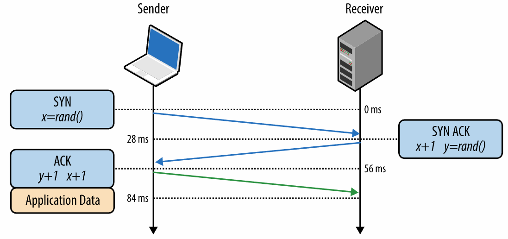
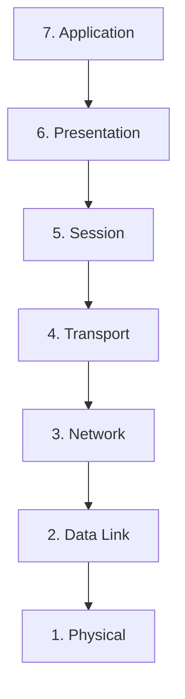

# High Performance Browser Networking - Learnings and Thoughts

When I was looking for 'DDIA-like' equivalents for other domains HPBN came up frequently as the equivalent for networking. This blogpost represents my 'study notes' for the book.

# Chapters

## Chapter 1 - Latency and Bandwidth

Latency: Time taken for a packet to travel from its point of origin to the point of destinatin. Delay breaks down into:
    - *Propagation delay*: Time for message to travel, which is (*distance* / *speed* of propagation)
    - Transmission delay: Time for packet's bits to be pushed into the link (*packet length* / *data rate* of the link)
    - Processing delay: Time taken to process the packet header, check for bit-level errors, and determine the packet's destination
    - Queuing delay: Time the packet is waiting in tthe queue until it is processed

Some general ideas to keep in mind regarding latency:
    - For *propagation delay*, the speed of light often comes into play as a significant source of slowness. For general rules of thumb:
    - Routers having to process packets' headers means that *queuing and processing delay* can add up to nontrivial amounts of time if there are large queues of packets passing through a router
    - *Transmission delays* can cause impact when significant volumes of data gets pushed through low-bandwidth links

{/* TODO: Generate a table of NYC/London/Singapore/Sydney with their optimized fiber latencies to each other */}

## Chapter 2 - Building Blocks of TCP

The Transmission Control Protocol and the Internet Protocol are the heart of the Internet. These allow systems to abstract a reliable network from unreliable underlying network channels. This was first proposed in 1974, and was the v4 specification (known in "IPv4") was published in 1981 under `RFC 791` and `RFC 793`. Today it is the backbone of many of the applications we use every day; HTTP, Email, FTPs, and many others.

TCP is optimized for *accuracy* instead of timeliness; there are many tradeoffs in its design that allow it to generate its reliability guarantees. All of the following are worked into the protocol:

- The order of bytes you send is the same as the order of the bytes the client will receive
- The bytes you send will be identical to the bytes received.
- Any lost data will be retransmitted (within reasonable constraints)
- Congestion management

### The Three Way Handshake

<Callout type="tip">
**Factoids**
- Accuracy over timeliness
- *Cost of establishing a TCP connection: one round-trip-time*
</Callout>

For two entities to communicate and establish a TCP connection, it must begin with a three-way-handshake. This has three phases:

1. A SYN packet with a random number `x` is sent from the sender to the receiver.
2. A SYN ACK packet with a random number `y`, along with `x+1`, is sent from the receiver to the sender.
3. An ACK packet with `x+1` and `y+1` is sent from the sender to the receiver.

This allows for the following to be established:

- The sender knows the receiver can read its data (given that it sends `x` and receives `x+1`)
- The receiver knows the sender can read its data (given that it sends `y` and receives `y+1`)

Altogether, this takes *three* trips (Sender -> Receiver, Receiver -> Sender, Sender -> Receiver), hence the name `three-way handshake`. However, in terms of latency cost, this costs only that of *two* trips, as data can be sent immediately from the sender following the ACK packet (no need to wait for ACK to be received by the receiver). 

Minor note - there's a segment on TCP Fast Open but it's not prevalent today unfortunately. Some of the overheads can be solved by other technologies like HTTP/2 multiplexing (single TCP, multiplexed connections to download assets, rather than one TCP connection per asset).

### Congestion Collapse

As TCP's reliability guarantees require a retransmission mechanism for any lost packets, an emergent possible stable-state phenomena is *congestion collapse*, when packets are consistently retransmitted due to intra-network issues like buffers being full and packets being dropped. Take this scenario:

- T=1: A 'slow-downloading' client joins the network tries to download a large file
- T=2: Whenever a packet isn't acknowledged within the sender's retransmission timeout (exponential back-off), it retransmits the packet.
- T=3: Every interceding network node (switches etc.) sees some fraction of these retransmitted packets and have to route them accordingly, a duplication of work that is bound by their own buffers.
- T=4: If the maximum retransmission timeout is hit (e.g. round-trip time too long), packets start *reliably* getting retransmitted, with most getting lost but some making it through. As buffers are full, the network as a whole starts seeing degraded performance as packets for other users start getting dropped.

### Flow Control

To address the problems from congestion collapse, flow control was introduced to prevent overloading from the sender to the receiver. To faciliate this, each side of a TCP connection advertises a `receive window (rwnd)` which communicates the size of the available buffer space. Throughout every ACK packet in a TCP connection, this `rwnd` value is updated, allowing for dynamic control of the rate of ingestion of data. If the window reaches zero, it's treated as a signal that no more data should be sent.

### TCP Slow-Start

Flow Control only addresses sender-receiver congestion issues; however, neither of them are privy to the bandwidth statistics of the network layer between them. This means that nothing is stopping them from overwhelming the network between them. In addition, this network usage control needs to be *dynamic* - throughout the lifetime of a TCP connection, the capability of the various network links in between can vary based on factors like competing neighboring activity. 

This is countered by another variable, the *Congestion window size (cwnd)*. This is a server-side limit on the amount of data the sender can have in flight before receiving an ack from the client. This is not advertised or exchanged; this is a private variable maintained by the server. This `cwnd` is combined with `rwnd` to form another constraint in TCP: `max(unacked in-flight data) == min(rwnd, cwnd)`. 

This constraint forces:

1. Implicit bottlenecking that can be managed by both ends of the connection
2. These variables (`rwnd`, `cwnd`) being affected by network circumstances allows for said network circumstances to tune the TCP connection throughput

How does `cwnd` allow a connection to respect its network links' constraints? Note that the "network links" here can be any number of connections from the client device, through its network switches, through its ISPs, through any intermediary fibre cables, all the way to the server device. All of these links can have varying 'available' bandwidth, which we cannot discover; the effective bandwidth will be the *lowest* bandwidth among all the links.

The solution is exponential iteration! Start with a small window size, leading to small bandwidth usage; if it fully succeeds with no packet loss, raise it multiplicatively. Keep raising it until you observe the first instance of packet loss, after which you multiplicatively reduce it. This allows your `min(rwnd, cwnd)` to achieve a steady-state of whatever your intermediary network links can support at the time. Running this algorithm across the lifetime of the connection allows your TCP connection to respond dynamically to the active constraints on the network; if at any time the network bandwidth halves (say, your dad starts streaming a 4K UHD YouTube video), everything currently using your modem will observe some packet loss and commensurately reduce its `cwnd` accordingly.

On the other hand, TCP slow-start can cause issues with latency, precisely because starts from some small base number (hence "slow start") - each exponential-growth iteration incurs a round-trip of latency. This initial `cwnd` can be tuned (Google `initcwnd`), but a large slow-start starting value can cause issues too; imagine broadcasting large sequences of data that consistently encounter packet loss, requiring retransmitting and halving of `cwnd`, over and over again until you fit into an already-full network link. DDOS-like behavior by clients is also possible, because now clients can serve large (possibly nonsensical) sequences of data to you from the beginning of each TCP connection.

# General Concepts

## 7 Layer OSI Model

The 7 Layer OSI Model allows us to understand the various abstractions that come into play when converting chaotic lossy signals on a physical level (cables) all the way to usable data on the application level.