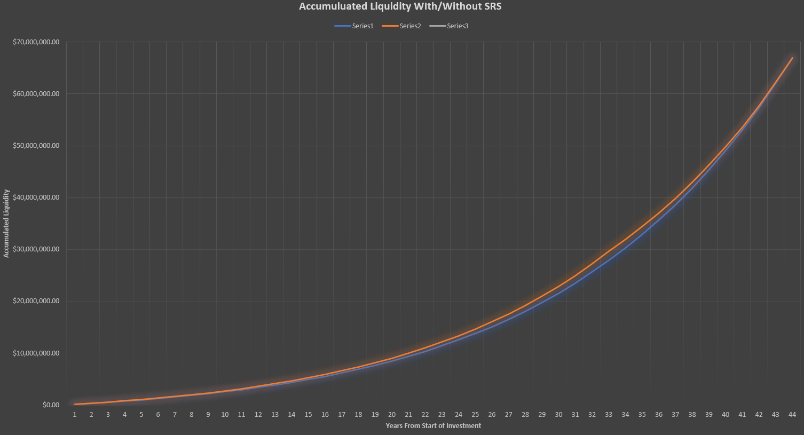
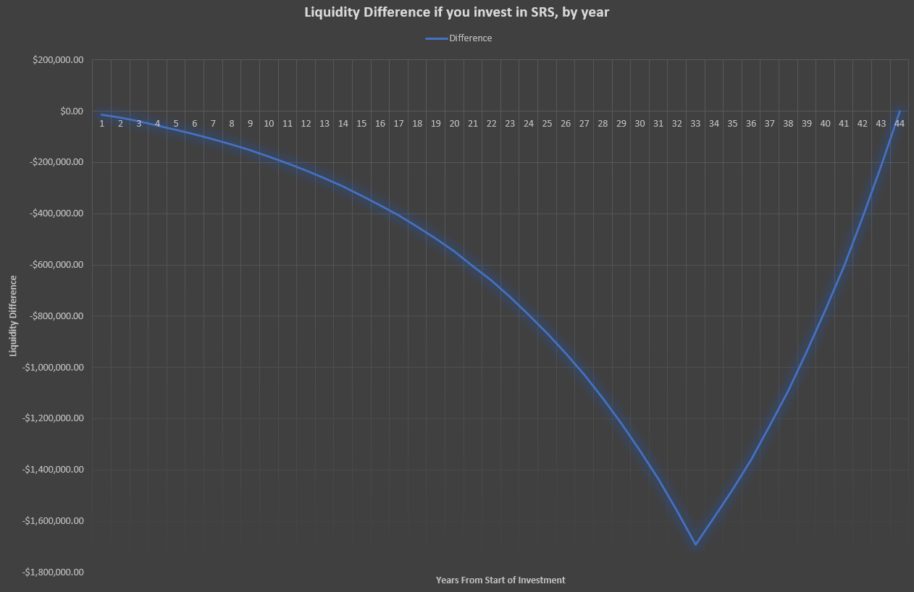

<Callout type="info">

# What is SRS?

The Supplementary Retirement Scheme (SRS) is a voluntary, tax-deferred savings program in Singapore designed to help individuals build retirement funds alongside their CPF. Contributions allow for dollar-for-dollar tax relief (up to S$15,300/year for Singaporeans/PRs; S$35,700/year for foreigners). Funds can be invested in various instruments, with 50% of withdrawals during retirement tax-free.

</Callout>

Back in 2024 I had a mini debate with a family member over how valuable it is to put savings in the SRS, given different (current) tax brackets. The SRS is effectively a tax deferment program; instead of paying 100% of taxes on (up to $15.3k) of your income today, you pay it *upon withdrawal after retirement age*, with the added bonus that only 50% of the withdrawn amount is subject to income tax (which, given Singapore's progressive tax model, works out to a larger cut in effective tax paid).

It sounds fine and dandy; however, there are a few major caveats:

- Your SRS funds become effectively illiquid; in the circumstances that you want to withdraw early, you have to pay a 5% fee, as well as 100% of the tax rate on the withdrawn sum (where, if you're still working, means you're paying the marginal tax rate of SRS *after* factoring in your income).
- After hitting retirement age, you must withdraw all SRS savings within the ensuing 10 years (for the purposes of 'breaking it up' across assessable-income years, that means you have to spread your SRS withdrawals out over 11 years to minimize the tax burden)
- SRS funds earn a baseline annual interest rate of 0.05% if left as cash in your SRS account, but certain platforms can be used where you can choose from a few SRS-vetted higher-risk portfolios (e.g. unleveraged all-equities funds with Roboadvisors like Endowus/Stashaway)

This leads us to a few questions:

1. How much do I value the liquidity of $15,300 per year?
2. What is the effective opportunity cost of funds invested in SRS, versus funds invested in my personal savings strategies sans. SRS?

Question 1 is relatively straightforward to answer; it'll equate to a rough liquidity loss of $1,275 per month, locked up until retirement age. Question 2, however, is quite multifaceted, with a large variety of factors depending on market conditions, personal risk appetite, tax regimes, so on and so forth.

<Callout type="info">
*Disclaimer: I use Endowus throughout this analysis as it's the cheapest platform I could find with access to 100% global equity ETF funds for SRS. If a lower-fee alternative exists, the numbers may shift in SRS's favor.*

| Platform | Type | All-in fee (p.a.) | 100% Global Equity? |
|---|---|---|---|
| POEMS / FSMOne (SGX ETFs) | DIY brokerage | ~0.03-0.20% | Limited (SGX-listed only) |
| Endowus Fund Smart (single fund) | Managed | ~0.40% (0.30% + ~0.10% fund) | Yes |
| FSMOne (unit trusts) | Fund platform | ~0.45% | Yes |
| Syfe Core Equity100 | Robo | ~0.55-0.85% (0.35-0.65% tiered + ~0.20% fund) | Yes |
| StashAway | Robo | ~0.35-0.95% (0.20-0.80% tiered + ~0.15% fund) | Yes |

*Syfe and StashAway fees are tiered by AUM. An SRS fund growing from $15k to ~$1.9M moves through multiple tiers over its lifetime. At peak SRS balances ($1M+), Syfe drops to 0.35% platform and StashAway to 0.20% platform.*
</Callout>

# Baseline Investment Numbers

A long-time-horizon investment plan with a 100% equity portfolio on Endowus is projected to grow at 7.69% per year. For the sake of comparison, we shall also use this as our *external* investment strategy.

Externally we invest in VWRA (FTSE All-World index) and SPY (S&P 500) - per these numbers from [Curvo](https://curvo.eu/backtest/en/compare?portfolios=NoIgag6gwgoiA0xQEkYAY0CEDSBWTAigCoAcaCAjALo1A%2C%20NoIgygZACgBArABgSANMUBJAokgQgZgA1CAlKBATlQEYBdeoA), both outperform 7.69%:

To normalize risk and returns for a fair comparison, let's say we use 7.69% for both for-SRS and ex-SRS strategies. I like to model these as *cash flows* - for each year, calculate the amount of funds invested, taxes paid, etc., and simply model the net sum at the end. Importantly, Endowus charges a **0.4% per-annum management fee** on top of underlying funds' expense ratios - this means that our effective interest rates are:

| Strategy | Details |
|---|---|
| Endowus | 1.0769 × 0.996 = 1.07256, or 7.256% |
| External investment | 7.69% |

Tax is calculated using Singapore's progressive income tax brackets (YA2025). Since the $15,300 SRS deduction comes off the top of your income, the tax savings occur at your **marginal rate** (18% at $200k, rising to 22% as income grows), not the effective rate.

# Investing Profile

| Parameter | Value |
|---|---|
| Age | 30 Years Old |
| Investing Risk Appetite | High (100% equities) |
| Starting Income | Varying from 120k~200k |
| Liquidity loss | ~$15,300 per year |
| Rate of Income growth | 2% |
| Endowus rate of growth | 7.256% |
| External rate of growth | 7.69% |
| Retirement Age | 63 |

# The Calculations

Given the above numbers, we can plug them all into excel formulae to generate projected returns for our various profiles. You can [download the spreadsheet here](SRS.xlsx) to play with the numbers yourself.

| Year | Liquidity with full SRS contribution | Liquidity with zero SRS contribution | Difference |
|------|--------------------------------------|--------------------------------------|------------|
| 2024 | $166,304.00 | $178,850.00 | -$12,546.00 |
| 2025 | $348,676.78 | $374,693.57 | -$26,016.79 |
| 2026 | $548,419.62 | $588,902.30 | -$40,482.68 |
| 2027 | $766,935.20 | $822,954.58 | -$56,019.38 |
| 2028 | $1,005,723.53 | $1,078,443.80 | -$72,720.27 |
| 2029 | $1,266,381.76 | $1,357,087.22 | -$90,705.46 |
| 2030 | $1,550,661.83 | $1,660,735.54 | -$110,073.71 |
| 2031 | $1,860,451.80 | $1,991,383.18 | -$130,931.38 |
| 2032 | $2,197,786.36 | $2,351,179.36 | -$153,393.00 |
| 2033 | $2,564,858.13 | $2,742,440.05 | -$177,581.92 |
| 2034 | $2,964,029.82 | $3,167,641.80 | -$203,611.98 |
| 2035 | $3,397,847.35 | $3,629,466.71 | -$231,619.36 |
| 2036 | $3,869,053.98 | $4,130,809.63 | -$261,755.65 |
| 2037 | $4,380,588.40 | $4,674,789.56 | -$294,201.16 |
| 2038 | $4,935,625.23 | $5,264,766.96 | -$329,141.73 |
| 2039 | $5,537,593.11 | $5,904,362.34 | -$366,769.23 |
| 2040 | $6,190,186.02 | $6,597,476.30 | -$407,290.28 |
| 2041 | $6,897,383.69 | $7,348,310.86 | -$450,927.16 |
| 2042 | $7,663,473.65 | $8,161,365.36 | -$497,891.72 |
| 2043 | $8,493,074.87 | $9,041,514.15 | -$548,439.28 |
| 2044 | $9,391,153.91 | $9,994,008.17 | -$602,854.26 |
| 2045 | $10,363,050.26 | $11,024,504.01 | -$661,453.75 |
| 2046 | $11,414,535.57 | $12,139,095.12 | -$724,559.55 |
| 2047 | $12,551,827.24 | $13,344,345.41 | -$792,518.18 |
| 2048 | $13,781,622.71 | $14,647,291.79 | -$865,669.07 |
| 2049 | $15,111,136.46 | $16,055,453.06 | -$944,316.60 |
| 2050 | $16,548,139.75 | $17,577,020.63 | -$1,028,880.88 |
| 2051 | $18,100,881.99 | $19,220,817.80 | -$1,119,935.82 |
| 2052 | $19,778,355.59 | $20,996,348.47 | -$1,217,992.88 |
| 2053 | $21,590,258.91 | $22,913,849.44 | -$1,323,590.53 |
| 2054 | $23,547,038.22 | $24,984,346.87 | -$1,437,308.64 |
| 2055 | $25,659,945.32 | $27,219,717.00 | -$1,559,771.68 |
| 2056 | $27,941,099.44 | $29,632,751.57 | -$1,691,652.12 |
| 2057 | $30,323,269.72 | $31,911,510.16 | -$1,588,240.44 |
| 2058 | $32,888,628.90 | $34,365,505.29 | -$1,476,876.39 |
| 2059 | $35,651,264.19 | $37,008,212.65 | -$1,356,948.46 |
| 2060 | $38,626,346.14 | $39,854,144.20 | -$1,227,798.06 |
| 2061 | $41,830,211.89 | $42,918,927.89 | -$1,088,716.00 |
| 2062 | $45,280,454.92 | $46,219,393.45 | -$938,938.53 |
| 2063 | $48,996,021.63 | $49,773,664.80 | -$777,643.17 |
| 2064 | $52,997,315.43 | $53,601,259.63 | -$603,944.20 |
| 2065 | $57,306,308.71 | $57,723,196.49 | -$416,887.78 |
| 2066 | $61,946,663.59 | $62,162,110.30 | -$215,446.71 |
| 2067 | $66,943,861.75 | $66,942,376.58 | +$1,485.17 |

Given my calculations, the numbers are surprisingly close. Given a starting income of $200k, we can see that *at almost no point in our life does SRS give us 'more money' than personally investing the funds* — the SRS profile only overtakes no-SRS by a razor-thin margin of **$1,485** in the very last year of withdrawal, on a ~$67M portfolio:

The general idea of SRS is that your 'accumulated liquidity' improves due to the tax deferment - you sacrifice early-age liquidity for lower taxes on the same funds in future. You would expect the SRS profile to 'overtake' the no-SRS profile during the withdrawal period as the tax savings come home. It technically does — but the gap peaks at **-$1.7M** at age 62 and only barely crosses zero at the very end:

# Confounding factors

There are several factors that may change our calculations going into the future:

| Factor | Impact |
|---|---|
| Tax Regime | If income tax is higher in future, SRS strategy *devalues* (pay more EIR tomorrow than EIR today) |
| Lower-fee vendors | If any cheaper alternative to Endowus shows up (&lt;0.4% fees), SRS strategy improves |
| Retirement Age | Irrelevant to me as the SRS Retirement age is fixed at time of first deposit; but for future new-adults, your accumulated sums may be different |
| Investment Strategy | It's generally advisable to migrate to less-risky portfolios as you age; e.g. a [three fund portfolio](https://curvo.eu/backtest/en/portfolio/three-fund--NoIgKgFgTgpjAEAzArgOwCYgDTFASQFEAGIgIQBYBGAJQE0AZANgGZsiA6Z8gXRxEJKlmADWHUACkQCcbTs175iZAGLlqygBLNKs5gCYpho8eONu5oA). However, this impacts both Endowus- and external investment strategies roughly equivalently. |

# Why is the system broken?

There are a few frictions that cause the majority of differences between our numbers:

1. The *Endowus 0.4% annual fee* adds significant compounded erosion. The SRS tax arbitrage is real — you save at your 18-22% marginal rate during accumulation and pay back at only ~3.76% effective during withdrawal (thanks to the 50% concession + progressive rates on a smaller base). This should be worth ~$720k over a lifetime. But the 0.4% annual fee compounds to erode almost exactly that amount, leaving SRS essentially breakeven. If we simply made the Endowus fee 0% (i.e. if there was some way to get equivalent outside rate of return to inside), SRS would win by ~$720k:

2. The 10-year cap on SRS withdrawals forces a compressed withdrawal schedule. By age 62, our SRS sum has compounded into $2,094,824.37; an even withdrawal strategy over 11 years requires -$268,388 per year (after taking into account compounding). After the 50% taxable amount haircut, this amounts to a 'taxable income' of ~$134k, or ~3.76% effective tax on the full withdrawal. This is actually quite favorable — the real issue is that a longer withdrawal period would let the remaining SRS balance compound further while keeping each withdrawal's taxable portion in lower brackets.
    - Note that SRS also introduces significant risk in the form of tax regimes. If Singapore tweaks the tax brackets in future (as we already have seen in [2024](https://www.iras.gov.sg/docs/default-source/budget-2022/budget-2022---overview-of-tax-changes69937d71-ba59-4b39-b1e5-7e85b2504e1c.pdf?sfvrsn=8339ba5a_5#:~:text=Effective%201%20Jan%202024&text=Enhance%20the%20progressivity%20of%20property%20tax%20for%20non%2Downer%2D%20occupied,two%20years%20as%20shown%20below.)), we would be subjecting our SRS deposits to whatever rates the government sets in future.

# Conclusion: Should I invest in SRS?

If you're savvy enough to invest yourself, with the profile above it's hard to see a compelling argument for investing in SRS. The tax arbitrage is real (save at 18-22% marginal, pay back at ~3.76% effective), but the fee erosion from SRS platforms almost exactly cancels it out, leaving you essentially breakeven against self-directed investment on platforms like IBKR. Going with SRS + Roboadvisor, we see:

1. Significantly reduced choices for investment funds
2. Annual percentage-based fee erosion of capital (0.3% to 0.4%)
3. Significant liquidity lockup
4. Risk in tax regime

And in return, we maybe see a *tiny* amount of net-cash-growth in the last few years of our SRS withdrawal period.

- With a 0.4% fee platform: roughly breakeven (the tax arbitrage and the fee erosion almost exactly cancel each other out)
- With a lower-fee platform: SRS wins
- With a higher-fee platform (>0.66%): SRS loses
- The liquidity lockup is the real unmodeled cost that tips the scale

## Side Note - Why do my numbers contradict common wisdom??

When I first got these results I was quite surprised, as general sentiment online has been largely in favor of investing in SRS; [a recent post last month](https://old.reddit.com/r/singaporefi/comments/1q0d2fz/debunking_the_myth_can_you_lose_money_investing/), for example, recommends 'if you are a HENRY (>$100k per year) it is always optimal to start contributing to SRS and investing it as early as possible'.

However, I downloaded his spreadsheet and noted a few factors:

1. In his own words, *it doesn't make sense to invest in SRS at all ages - there's a curve of an 'ideal age' to start investing in SRS*. My projections are specifically for 30 year olds. The author finds that it starts becoming profitable at age 34, for $200k income and 7.69% interest rate.
2. No platform fee erosion (assumes 7% both in and outside of SRS) - **this explains the main difference in recommendations**

Having taken these factors into account, I decided I won't be following the SRS scheme, given the significant downsides and negligible upside.

