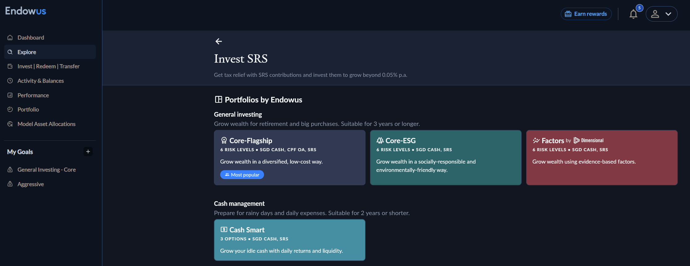
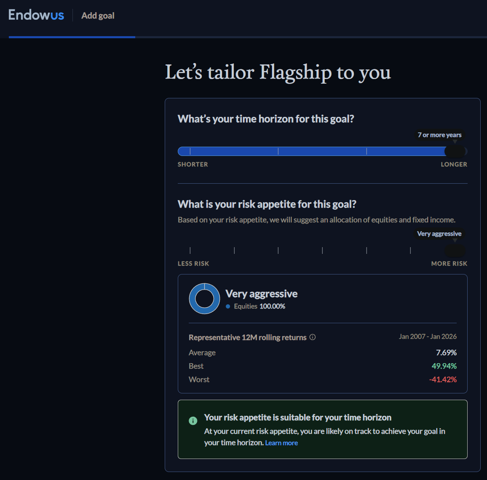
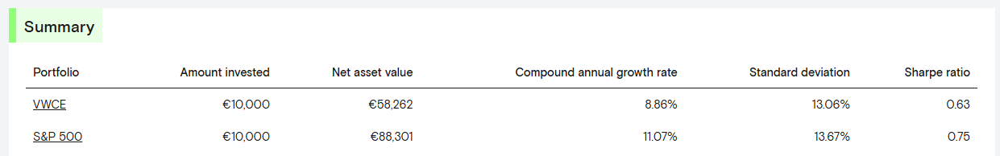
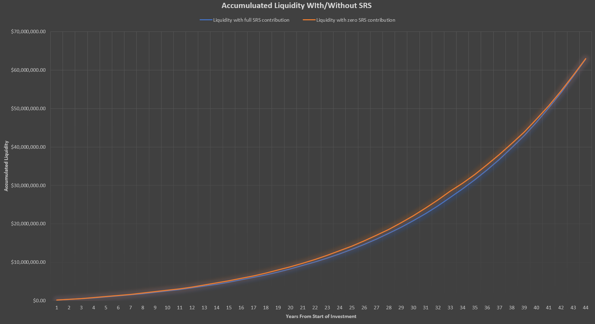
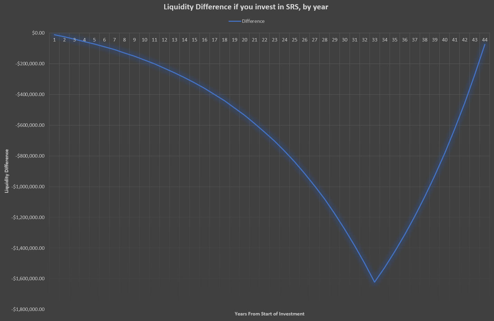
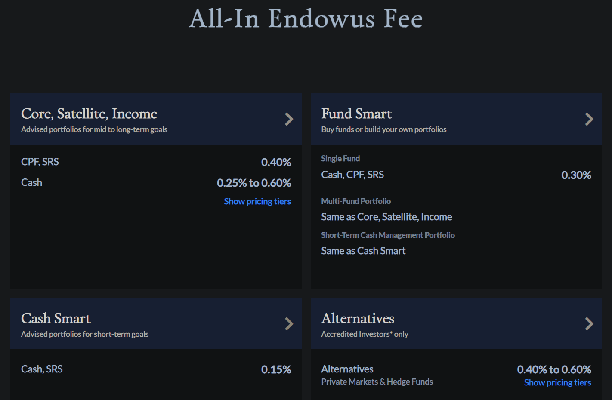
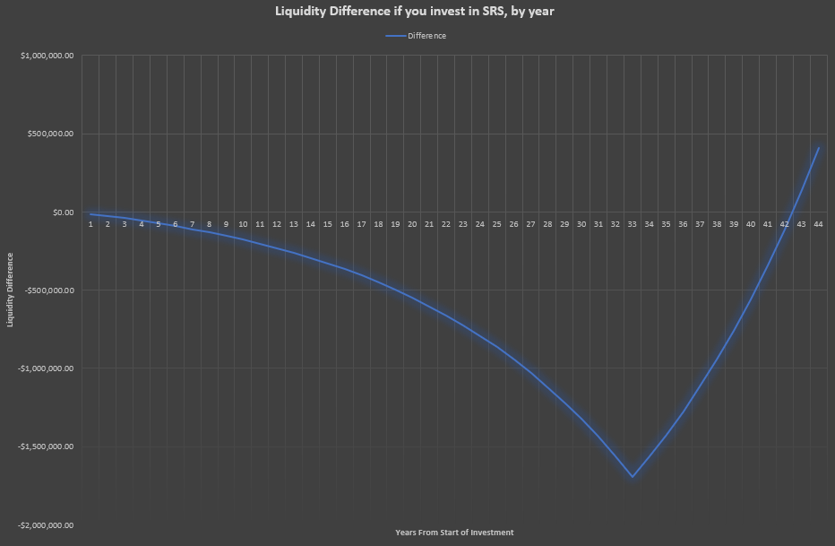

<Callout type="info">

**What is SRS?**

The Supplementary Retirement Scheme (SRS) is a voluntary, tax-deferred savings program in Singapore designed to help individuals build retirement funds alongside their CPF. Contributions allow for dollar-for-dollar tax relief (up to S$15,300/year for Singaporeans/PRs; S$35,700/year for foreigners). Funds can be invested in various instruments, with 50% of withdrawals during retirement tax-free.

</Callout>

Back in 2024 I had a mini debate with a family member over how valuable it is to put savings in the SRS, given various tax brackets and its purported savings benefits. The SRS is effectively a tax deferment program; instead of paying 100% of taxes on (up to $15.3k) of your income today, you pay it *upon withdrawal after retirement age*, with the added bonus that only 50% of the withdrawn amount is subject to income tax (which, given Singapore's progressive tax model, works out to a larger cut in effective tax paid).

It sounds fine and dandy; however, there are a few major caveats:

- Your SRS funds become effectively illiquid; if you withdraw early, the full withdrawn amount is subject to income tax (no 50% concession), plus a 5% penalty. If you're still working, this means you're paying tax at your marginal rate *after* factoring in your employment income.
- After making your first penalty-free withdrawal (available from retirement age), you have 10 years to withdraw all SRS savings (for the purposes of 'breaking it up' across assessable-income years, that means you have to spread your SRS withdrawals out over 11 years to minimize the tax burden)
- SRS funds earn a baseline annual interest rate of 0.05% if left as cash in your SRS account, but certain platforms can be used where you can choose from a few SRS-vetted higher-risk portfolios (e.g. unleveraged all-equities funds with Roboadvisors like Endowus/Stashaway)

This leads us to a few questions:

1. How much do I value the liquidity of $15,300 per year?
2. What is the effective opportunity cost of funds invested in SRS, versus funds invested in my personal savings strategies without SRS?

Question 1 is relatively straightforward to answer; it'll equate to a rough liquidity loss of $1,275 per month, locked up until retirement age, and the impact of this on my lifestyle is subject to how significant $1,275 is relative to my monthly disposable income. For the sake of calculation, let's say I'm willing to part with this $1,275 monthly amount with no problems.

Question 2, however, is quite multifaceted, depending on a large variety of factors like market conditions, personal risk appetite, and tax regimes. We'll try to be as quantitative as possible with our analyses, but some factors are simply qualitative in nature, so some level of subjectivity will be involved in our eventual conclusions.

**What's ahead:**

- The fee landscape for SRS platforms (Endowus, Syfe, StashAway)
- Baseline return assumptions and fee-adjusted growth rates
- A 33-year projection comparing SRS vs. direct investment
- Why brokerage fees and withdrawal caps erode the tax arbitrage
- My conclusion and when SRS might still make sense

<Callout type="info">
*Disclaimer: I use Endowus throughout this analysis as it's the cheapest platform I could find with access to 100% global equity ETF funds for SRS. If a lower-fee alternative exists, the numbers may shift in SRS's favor.*

| Platform | Type | All-in fee (p.a.) | 100% Global Equity? |
|---|---|---|---|
| POEMS / FSMOne (SGX ETFs) | DIY brokerage | ~0.03-0.20% | Limited (SGX-listed only) |
| Endowus Fund Smart (single fund) | Managed | ~0.40% (0.30% + ~0.10% fund) | Yes |
| FSMOne (unit trusts) | Fund platform | ~0.45% | Yes |
| Syfe Core Equity100 | Robo | ~0.55-0.85% (0.35-0.65% tiered + ~0.20% fund) | Yes |
| StashAway | Robo | ~0.35-0.95% (0.20-0.80% tiered + ~0.15% fund) | Yes |

*Syfe and StashAway fees are tiered by AUM. An SRS fund growing from $15k to ~$1.9M moves through multiple tiers over its lifetime. At peak SRS balances ($1M+), Syfe drops to 0.35% platform and StashAway to 0.20% platform.*
</Callout>

# Baseline Investment Numbers

A long-time-horizon investment plan with a 100% equity portfolio on Endowus is projected to grow at 7.69% per year. For the sake of comparison, we shall also use this as our *external* investment strategy.

Externally we invest in VWRA (FTSE All-World index) and SPY (S&P 500) - per these numbers from [Curvo](https://curvo.eu/backtest/en/compare?portfolios=NoIgag6gwgoiA0xQEkYAY0CEDSBWTAigCoAcaCAjALo1A%2C%20NoIgygZACgBArABgSANMUBJAokgQgZgA1CAlKBATlQEYBdeoA), both outperform 7.69%:

To normalize risk and returns for a fair comparison, let's say we use 7.69% for both SRS and non-SRS strategies. I like to model these as *cash flows* - for each year, calculate the amount of funds invested, taxes paid, etc., and simply model the net sum at the end. Importantly, Endowus charges a **0.3~0.4% per-annum management fee** on top of underlying funds' expense ratios.

Note that Endowus imposes additional restrictions on what assets can be invested in; this means that we may also inadvertently pay different expense ratios based on Endowus's allocations.

*I've found that Endowus Fund-Smart allows for specific SRS investment in the [Amundi Index MSCI World Fund](https://endowus.com/investment-funds-list/amundi-index-msci-world-fund-LU2420245917), which on top of having a 0.1% expense ratio also only has a 0.3% Endowus management fee (for single-fund goals). This brings the Endowus-IBKR delta to closer to ~0.21% rather than 0.50% (0.3% + 0.1% vs VWRA's 0.19%), if you choose to pursue this strategy.*

 generates an estimated blended expense ratio of 0.29%, which is much more than VWRA (0.19%) or S&P 500 (CSPX, 0.07%)](endowus-aggressive-allocations.png)

| Strategy | Details |
|---|---|
| Endowus (100% Aggressive) | 0.4% management + 0.29% expense: 1.0769 × 0.996 × 0.9971 = 1.06948, or 6.948% |
| Endowus (Fund-Smart, Amundi MSCI World) | 0.3% management + 0.1% expense: 1.0769 × 0.997 × 0.999 = 1.07260, or 7.260% |
| IBKR (VWRA) | 0.19% expense: 1.0769 × 0.9981 = 1.07485, or 7.485% |

Tax is calculated using Singapore's progressive income tax brackets (YA2025). Since the $15,300 SRS deduction comes off the top of your income, the tax savings occur at your **marginal rate** (for reference: 11.5% at $120k, 18% at $200k, rising to 24% as income grows beyond $1m), not the effective rate.

# Investing Profile

| Parameter | Value |
|---|---|
| Age | 30 Years Old |
| Investing Risk Appetite | High (100% equities) |
| Starting Income | Varying from 120k~200k |
| Liquidity loss | ~$15,300 per year |
| Rate of Income growth | 2% |
| Endowus (100% Aggressive) rate of growth | 6.948% |
| Endowus (Fund-Smart, Amundi MSCI World) rate of growth | 7.260% |
| IBKR (VWRA) rate of growth | 7.485% |
| Retirement Age | 63 |

# The Calculations

Given the above numbers, we can plug them all into excel formulae to generate projected returns for our various profiles. You can [download the spreadsheet here](SRS.xlsx) to play with the numbers yourself.

| Year | Liquidity with full SRS contribution | Liquidity with zero SRS contribution | Difference |
|------|--------------------------------------|--------------------------------------|------------|
| 2024 | $166,304.00 | $178,850.00 | -$12,546.00 |
| 2029 | $1,259,988.62 | $1,350,225.13 | -$90,236.51 |
| 2034 | $2,932,938.67 | $3,134,337.36 | -$201,398.69 |
| 2039 | $5,447,295.28 | $5,807,799.59 | -$360,504.31 |
| 2044 | $9,180,067.85 | $9,768,604.58 | -$588,536.73 |
| 2049 | $14,673,286.54 | $15,588,492.56 | -$915,206.01 |
| 2054 | $22,704,703.88 | $24,086,997.11 | -$1,382,293.23 |
| 2056 | $26,863,461.02 | $28,485,189.14 | -$1,621,728.12 |
| 2057 | $29,091,108.47 | $30,617,305.54 | -$1,526,197.08 |
| 2062 | $42,994,482.96 | $43,924,443.93 | -$929,960.97 |
| 2067 | $62,940,653.35 | $63,015,237.32 | -$74,583.97 |

*Showing every 5th year, plus the peak gap (2056) and start of withdrawal period (2057). [Download the full spreadsheet](SRS.xlsx) for all 44 years.*

Given my calculations, the numbers are surprisingly close. Given a starting income of $200k, we can see that *at no point in our life does SRS give us 'more money' than personally investing the funds* - the SRS profile **never overtakes** no-SRS, still trailing by **-$74,584** even in the very last year of withdrawal, on a ~$63M portfolio:

The general idea of SRS is that your 'accumulated liquidity' improves due to the tax deferment - you sacrifice early-age liquidity for lower taxes on the same funds in future. You would expect the SRS profile to 'overtake' the no-SRS profile during the withdrawal period as the tax savings come home. **It never does** - the gap peaks at **-$1.6M** at age 62 and narrows during withdrawals but never crosses zero:

This essentially means that based on the profile above, SRS involves sacrificing a large amount of liquidity over the course of your life and never breaking even; a lot of downsides for no upside at the end.

# What!? Why?

Surely the government wouldn't create a tax policy that is so negatively skewed for citizens..? There are a few frictions that cause the majority of impact on the outcome:

## Brokerage fees

The *Endowus 0.4% management fee + 0.29% expense ratio* adds significant compounded erosion. The SRS tax arbitrage is real - you save at your 18-22% marginal rate during accumulation and pay back at only ~3.2% effective during withdrawal (thanks to the 50% concession + progressive rates on a smaller base). This should be worth ~$400k over a lifetime; however, the combined 0.69% annual fee drag compounds to erode more than that amount, leaving SRS net-negative.

### Using Endowus Fund-Smart with Amundi MSCI World Fund

If we use Endowus Fund-Smart with the Amundi World Index instead, the fees are slightly lower, leading to a profit, in the *last year of withdrawals*:

| Year | Liquidity with full SRS contribution | Liquidity with zero SRS contribution | Difference |
|------|--------------------------------------|--------------------------------------|------------|
| 2024 | $166,304.00 | $178,850.00 | -$12,546.00 |
| ... | | | |
| 2065 | $54,293,411.78 | $54,544,360.54 | -$250,948.76 |
| 2066 | $58,590,814.80 | $58,627,005.93 | -$36,191.13 |
| 2067 | $63,209,878.44 | $63,015,237.32 | +$194,641.12 |

### Assuming best case scenario with zero fees

If we simply made the Endowus fee 0% (i.e. if there was some way to get equivalent outside-SRS rate of return to inside-SRS), SRS would win by ~$400k - though notably, it *only turns a profit from the second last year of withdrawals*:

| Year | Liquidity with full SRS contribution | Liquidity with zero SRS contribution | Difference |
|------|--------------------------------------|--------------------------------------|------------|
| 2024 | $166,304.00 | $178,850.00 | -$12,546.00 |
| ... | | | |
| 2065 | $54,447,699.25 | $54,544,360.54 | -$96,661.29 |
| 2066 | $58,769,274.22 | $58,627,005.93 | +$142,268.29 |
| 2067 | $63,414,319.08 | $63,015,237.32 | +$399,081.76 |

The fact that even with zero annual fees SRS only starts being profitable at the end is something to be noted; that means that we're losing liquidity for ~41 years, turning 'profitable' on the 42nd year, before capping off all withdrawals on the 43rd year. Whether this makes sense is entirely up to the user; this might feel perfectly fine if seen as a 'retirement savings' vehicle.

## 10-Year withdrawal cap

The 10-year cap on SRS withdrawals forces a compressed withdrawal schedule. By age 62, our SRS sum has compounded into $1,800,622.11; an even withdrawal strategy over 11 years requires ~-$231,000 per year (after taking into account compounding). After the 50% taxable amount haircut, this amounts to a 'taxable income' of ~$115k, or ~3.2% effective tax on the full withdrawal. This is actually quite favorable - the real issue is that a longer withdrawal period would let the remaining SRS balance compound further while keeping each withdrawal's taxable portion in lower brackets.
    - Note that SRS also introduces significant risk in the form of tax regimes. If Singapore tweaks the tax brackets in future (as we already have seen in [2024](https://www.iras.gov.sg/docs/default-source/budget-2022/budget-2022---overview-of-tax-changes69937d71-ba59-4b39-b1e5-7e85b2504e1c.pdf?sfvrsn=8339ba5a_5#:~:text=Effective%201%20Jan%202024&text=Enhance%20the%20progressivity%20of%20property%20tax%20for%20non%2Downer%2D%20occupied,two%20years%20as%20shown%20below.)), we would be subjecting our SRS deposits to whatever rates the government sets in future.

## Possible confounding factors

These calculations are all based on the present state of affairs for a Singapore citizen. There are several factors that may change our calculations:

| Factor | Impact |
|---|---|
| Tax Regime | If income tax is higher in future, SRS strategy *devalues* (pay more EIR tomorrow than EIR today) |
| Lower-fee vendors | If any cheaper alternative to Endowus shows up (&lt;0.69% all-in fees), SRS strategy improves; the extreme edge case (0% fees) shows a net benefit of ~$400k by the end of the SRS withdrawal period; which is nice, but also amounts to less than 1% of our liquidity at age 72... |
| Retirement Age | Irrelevant to me as the SRS Retirement age is fixed at time of first deposit; but for future new-adults, your accumulated sums may be different |
| Investment Strategy | It's generally advisable to migrate to less-risky portfolios as you age; e.g. a [three fund portfolio](https://curvo.eu/backtest/en/portfolio/three-fund--NoIgKgFgTgpjAEAzArgOwCYgDTFASQFEAGIgIQBYBGAJQE0AZANgGZsiA6Z8gXRxEJKlmADWHUACkQCcbTs175iZAGLlqygBLNKs5gCYpho8eONu5oA). However, this impacts both Endowus- and external investment strategies roughly equivalently. |

## Side Note - Why do my numbers contradict common wisdom??

When I first got these results I was quite surprised, as general sentiment online has been largely in favor of investing in SRS; [a recent post last month](https://old.reddit.com/r/singaporefi/comments/1q0d2fz/debunking_the_myth_can_you_lose_money_investing/), for example, recommends 'if you are a HENRY (>$100k income per year) it is always optimal to start contributing to SRS and investing it as early as possible'.

However, I downloaded his spreadsheet and noted a few factors:

1. In his own words, *it doesn't make sense to invest in SRS at all ages - there's a curve of an 'ideal age' to start investing in SRS*. My projections are specifically for 30 year olds. The author finds that it starts becoming profitable at age 34, for $200k income and 7.69% interest rate.
2. He assumed there was no platform fee erosion (assumes the same 7% return both in and outside of SRS) - **this explains the main difference in recommendations**

# Conclusion: Should I invest in SRS?

If you're savvy enough to invest yourself, with the profile above it's hard to see a compelling argument for investing in SRS. The tax arbitrage is real (save at 18-22% marginal, pay back at ~3.2% effective), but the fee erosion from SRS platforms more than cancels it out, leaving you net-negative against self-directed investment on platforms like IBKR. Going with SRS + Roboadvisor, we see:

1. Significantly reduced choices for investment funds
2. Annual percentage-based fee erosion of capital (0.40% to 0.69% all-in)
3. Significant liquidity lockup
4. Risk in tax regime

And in return, we end up net-negative even at the very end of our SRS withdrawal period.

- With a 0.69% all-in fee (Endowus 100% Aggressive): SRS loses, trailing by ~$75k even in the final year
- With a 0.40% all-in fee (Endowus Fund-Smart): roughly breakeven
- With a higher-fee platform (>0.69%): SRS loses more
- The liquidity lockup is a significant unmodeled cost - are we willing to lock up such a significant amount of funds until retirement?

## Other factors

Note that I haven't included a few factors; I've tried to make assumptions for these factors in favor of SRS, in an attempt to demonstrate that 'even when biased towards SRS it doesn't break even':

- The automatic portfolio selection by Endowus introduces some convenience (good for SRS) but also some limitations (bad for SRS) - some strategies (e.g. 'heavy on Chinese equities via specific ETFs like `iShares Core MSCI China`') are not possible.
- The effective fee difference between *Endowus 100% Aggressive* (0.69% all-in) and *IBKR VWRA* (0.19% expense) is 0.50%, which introduces significant drag for the SRS portfolio
- Optionality: SRS funds are permanently locked into SRS, which introduces vendor-risk; if Endowus went belly-up tomorrow, we'd need to find an alternative platform with possibly worse rates, and we wouldn't be able to pull SRS funds out without significant financial penalties.

## When would I go for SRS?

There are only a few scenarios in which I'd recommend going with SRS:

- You plan to use *the same investment platform* within and without SRS (i.e. you're already paying the same fees on both sides)
- You like the idea of locking liquidity up as a form of forced-retirement savings (you do you, man)
- You think the future income tax regime is going to be *lighter* than today's tax rates
- You want your money going to `{platform, e.g. Endowus}` in fees instead of the Government in taxes
    - Personally, I see taxes as being more beneficial to society, so this skews my decision in favor of no-SRS a little as well
- You think SRS benefits improve in future - since there is a hard cap on rate-of-SRS-investment, we cannot retroactively decide to invest $500k into SRS if suddenly it becomes highly profitable to use SRS.

## And so...

Having taken all of these factors into account, I decided I won't be leveraging SRS in own personal investment strategy, given the significant downsides and negligible upside. The policy is perhaps a little too asymmetric, and the investment landscape for SRS funds a little too restrictive, for me to think of it as a viable alternative to personal investing in ultra-low-cost ETFs like VWRA and SPX.

*This is a personal analysis, not financial advice. Your circumstances, income, risk appetite, and platform choices may differ — run the numbers for your own profile.*
