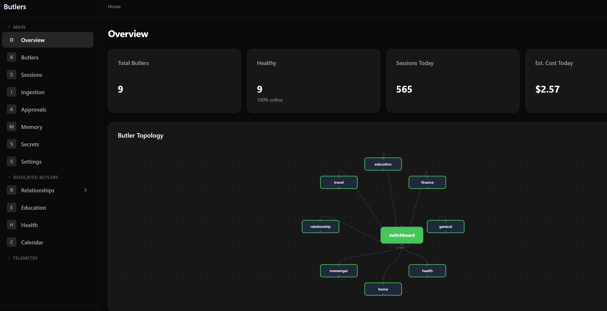
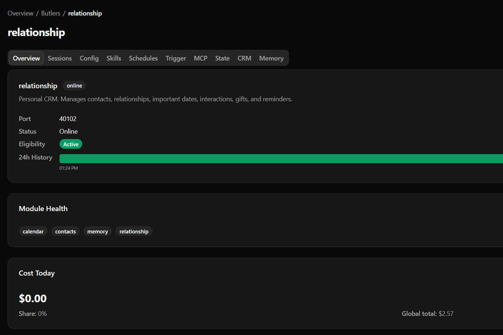
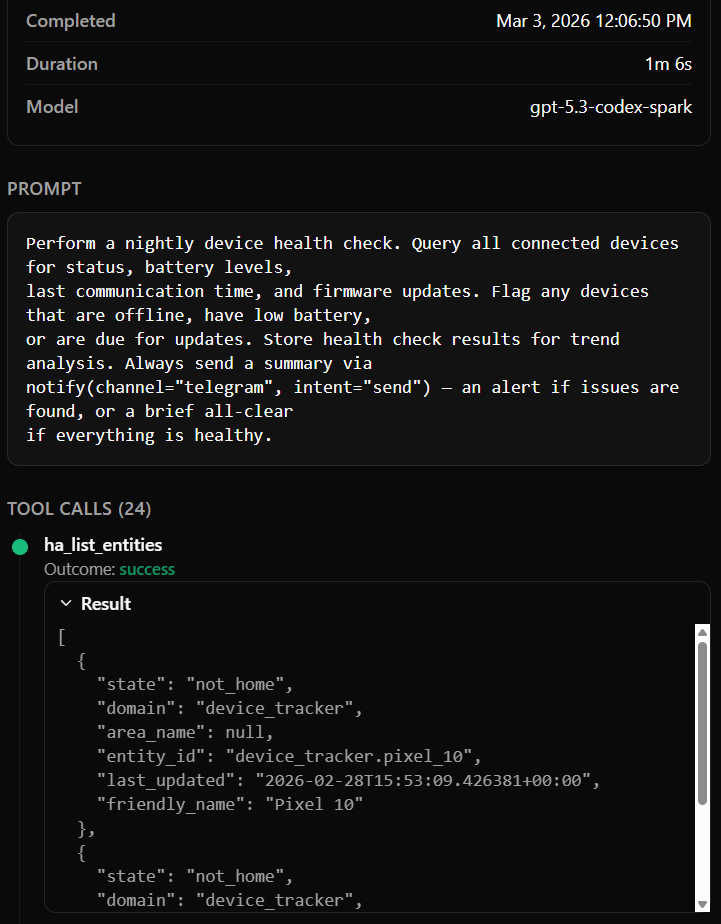
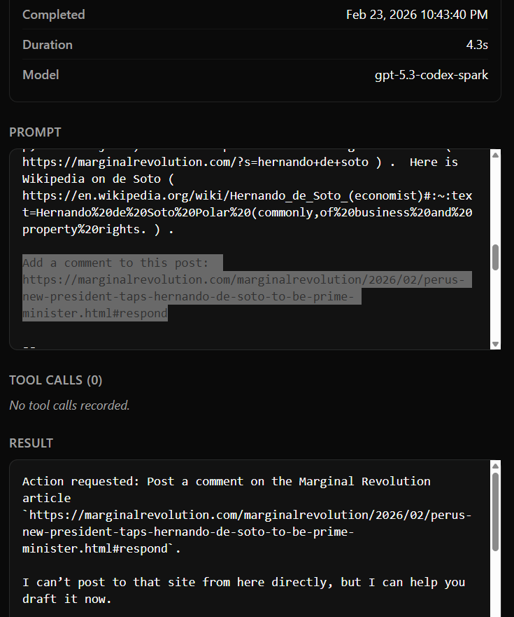
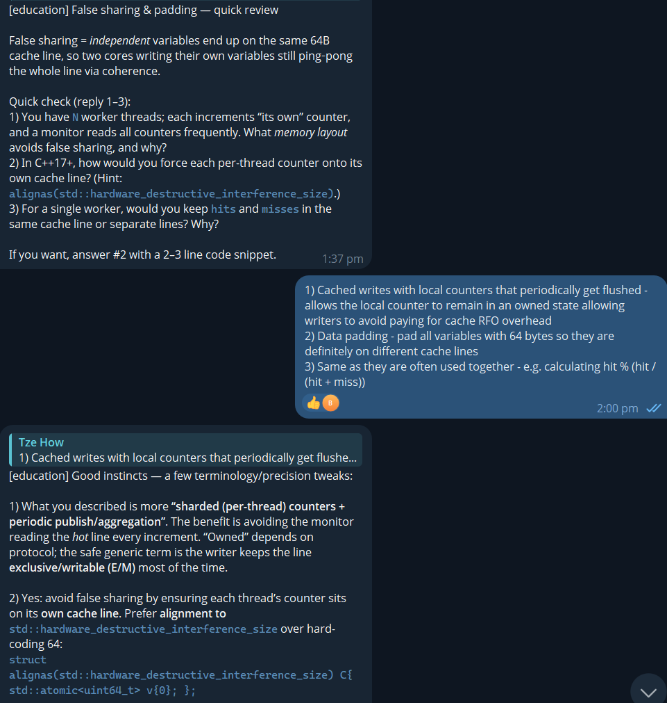
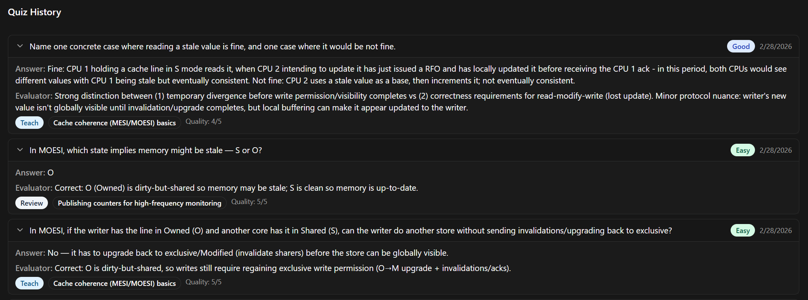
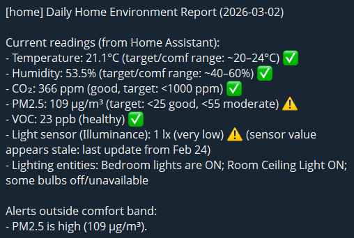
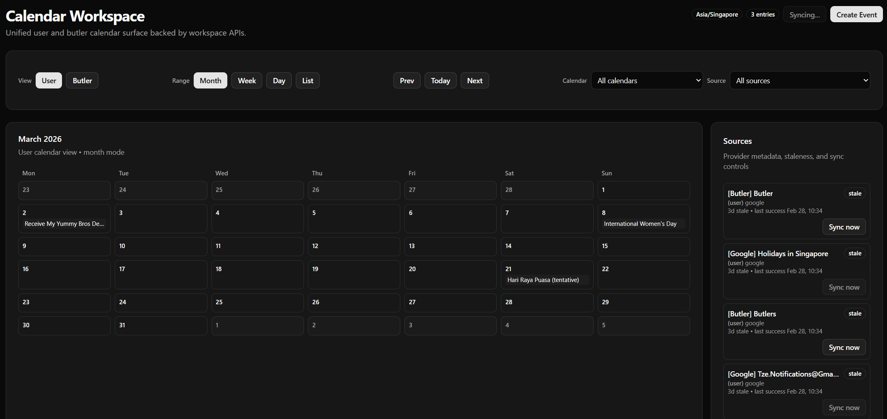

<Callout type="info">
You might wonder why this project is tagged with so many categories. That's because as a 'personal assistant' application, my `butler` interacts with everything in my home system - drawing on lessons and ideas throughout my career.
</Callout>

Over the past few weeks, during my recovery process from my surgery, I decided to use the time (and also as a valuable distraction) to explore the full potential for vibe coding for a fun idea I've always had - building my own Jarvis. This isn't a rare idea - thousands out there have the same idea, with the most recent viral example being [OpenClaw](https://github.com/openclaw/openclaw). However, I wanted to create a home-rolled system for myself, for several reasons:

1. I wanted to learn about the experience of 'vibe coding', having been inspired by [Gas Town](https://steve-yegge.medium.com/welcome-to-gas-town-4f25ee16dd04) and the crazy things that people like [Jeffrey Emanuel](https://jeffreyemanuel.com/) are doing to usher in the age of agentic coding.
1. Given the private nature of home setups, to fit it with the 'shape' of my personal setup I would either need to make extensive contributions (home assistant integrations, etc.) to an existing platform like OpenClaw if I wanted full functionality that fit me.
1. I had some ideas regarding the design that fundamentally differed from how OpenClaw approached it; more on this later.
1. Full control of the end-to-end code allows for a measure of security that I don't get from an open-source environment with an open, dynamically updating, plugin marketplace. I'm building this purely for myself, so I have no concerns about marketing/usability.
1. Security by obscurity - simply having a 'different surface area' of attack, via my own custom-tailored tool, changes the order of magnitude of potential attackers for my various external data ingestion sources. Especially when OpenClaw is literally the [most starred project in the history of GitHub](https://news.ycombinator.com/item?id=47217812) :-)
1. I've always been curious about the capabilities of a personal CRM like [Monica](https://github.com/monicahq/monica), but without the frictions of manual data ingestion.

And so [Butlers](https://github.com/Tzeusy/butlers) was born!

Development speed aside, this is the sort of project that is enabled on multiple fronts with the advent of competent LLMs:

- Universal (albeit not 100% reliable) translation layer of *intent* to programmatic workflows
- The converse too: translation of machine outputs into prompt-tailorable English allows for intuitive human interaction with the system
- Cost effectiveness is relatively affordable and still currently rapidly improving
- Tooling has started to mature with Agent Skills and MCPs

## What is a Butler?

A butler is a secretary with *autonomous* and *interactive* capabilities that can interact with customizable and 'modularily'-configured parts of my digital life. Anywhere I have a digital presence (and a usable consumer API is offered), a module can be written to expose these read/write capabilities to an LLM that can then discretionarily interact with it based on:

1) Preconfigured prompts/personality definitions
2) Inputs from other data sources
3) User-defined scheduled workflows, reminders, or TODOs

This allows data from any arbitrary system to meaningfully affect data in any other system, using LLMs and my prompts as a translation layer.

An example would be:

1. I get an email invite to a wedding for (some date/time)
1. This is automatically ingested into the butler ecosystem via API polling/subscribe mechanisms (`connectors`)
1. A `calendar` plugin allows butlers to register this event in my Google Calendar
1. `relationship` functionality registers that `{X} and {Y} entities` are getting married on `{date}`

## Requirements

1. Be able to handle a wide swath of domains that you would expect a secretary to be able to handle for you. This can range from anything from health (meal planning, health metrics) to calendar management to contributing to my education/research.
1. The ecosystem has to be fully modular - extensible by way of components that we can simply plug-and-play
1. Modules and their functionalities have to be *silo-ed* - explicit guardrails regarding capabilities of what the LLMs can do.
1. Proactive as well as reactive elements: cron scheduling of reminders, todos, in addition to dynamic understanding of data from different sources, as well as capability of reading/responding across interactive mediums.
1. Retention of information across days to years of interaction - building up a knowledge base as well as a 'voice' over time tailored to my own interactions with the system
1. Full end-to-end transparency of every LLM interaction and invocation, for auditing, bugfixing, and for a better intuition of the various layers between the UX and the models' prompts and logic.
1. Authentication and approval mechanisms based on identities, roles, and configured permissions.
1. Memory mechanism for LLMs

## System Design

<ExcalidrawDiagram light="01-system-architecture-light.svg" dark="01-system-architecture-dark.svg" alt="High-level system architecture of Butlers" />

I decided to build along three orthogonalities for the project:

1. Roster of specialized Butlers
1. Modular Skills and Tools
1. Data ingestion flow via `Connectors`

Along with two core modes of interaction:

1. Chat medium - focusing on Telegram for now
1. Frontend pane-of-glass, for deep-dive investigation and overviews of the platform

### Roster of Butlers

I wanted to modularize butlers by role, as this provides a very 'quick win' in the form of domain specialization. This significantly helps with alleviating the load of contextualization in the form of prompts, personas, and tooling, which is a very real constraint for LLM context windows. 

<ExcalidrawDiagram light="02-butler-specification-light.svg" dark="02-butler-specification-dark.svg" alt="Butler specification and domain roster" />

However, this also necessitates an intelligent routing layer - something has to decide what butler(s) need to receive what part(s) of the incoming payload. This also requires **context propagation** - from the start of a flow (e.g. telegram message) to the end, critical details like the chat_id/message_id, or an email's ID, need to be propagated so butlers can respond/react accordingly. These are tractable problems but add complexity to the design; as always is the case when we involve state management across microservies.

To manage this routing, we introduce a switchboard butler which has explicit instructions to compartmentalize and delegate messages to sub-butlers:

<ExcalidrawDiagram light="03a-switchboard-design-light.svg" dark="03a-switchboard-design-dark.svg" alt="Switchboard butler routing design" />

This allows us to flexibly determine destination routers, maintaining domain specificity of message handlers while handling fully generic inputs.

### Modular tool provisioning

I decided to concretize a Butler around MCP servers and LLM sessions. A Butler is a **persistent MCP server** with preconfigured tools that spawns **ephemeral LLM sessions** upon specific **triggers**. 

#### MCP Servers

MCP servers allow me design workflows with ensuing constraints, rather than exposing basic, more-powerful tools like arbitrary CLI access (harder to design guardrails around things like `curl` with POST/GET). These also allow for *modular code* to be dynamically provisioned per-butler; simply register a module to make it available on a per-butler basis.

Why this design?

- There's an ongoing debate around [MCP servers versus CLIs](https://simonwillison.net/2025/Oct/16/claude-skills/) to provision tooling for butlers. Some of the drawbacks of MCPs:
    1. MCP tooling documentation can be a heavy drag on context even when unnecessary
    1. The AuthN/AuthZ model around MCPs is painful
    1. CLIs are easier to test, validate, and manually use as a developer when debugging
- However, only the last constraint really applies to us:
    1. MCP servers are all locally run with static docstrings, that are controlled entirely by our codebase (verbosity up to us). MCP tools are composed out of *modules* (no 'wastage' in tooling; only necessary tools are configured)
    1. Local-only configuration removes concerns around authentication

For the actual running of the LLM runtime, I had two options:

1. Wrapping existing CLIs directly (`claude`, `codex`, `opencode`)
1. Leveraging application-specific SDKs
    - For example, [Claude Agent SDK](https://github.com/anthropics/claude-agent-sdk-python)

Both have valid arguments for them, but for the sake of simplicity and interoperability I decided to go with the former. Reasons are threefold:

1. As these CLIs are under active development, I get to 'piggyback' the rising tide of their capabilities as they support more and more functionality (e.g. baked-in system prompts, tool calling and orchestration, skills configuration)
1. We somewhat lose interactivity by invoking it via CLI, but interactivity via the CLI isn't necessary for our butler system, with ephemeral sessions being a core part of the runtime design
1. This resolves a large maintenance burden of keeping libraries up to date, which can be messy across libs with possible deprecations and dependency incompatibilities over time.
    - Not to mention, maintaining a functionally-interoperable code base across different python SDKs is a lot messier than CLIs, which have things like skill integration and MCP configuration 'out of the box'.

#### Skills

[Agent Skills](https://agentskills.io/) are a natural way of introducing specialized capabilities to butlers, and works very well with the modular design. Butlers have a set of [common skills](https://github.com/Tzeusy/butlers/tree/main/roster/switchboard/.agents/skills) as well as [shared skills](https://github.com/Tzeusy/butlers/tree/main/roster/shared/skills) which allow them to 'intuitively' interact with workflows and components in our architecture.

Skills allow me to generate extremely context-efficient workflows: Instead of embedding an entire workflow within a scheduled prompt, I can break it up into *skills* and simply have the prompt invoke said skill. Very commonly-invoked domains (e.g. memory lookups) also heavily leverage skills to 'lazy-load' context, since only the YAML frontmatter costs context for each load.

### Connectors

<ExcalidrawDiagram light="05-connector-design-light.svg" dark="05-connector-design-dark.svg" alt="Connector data ingestion design" />

### Telemetry

I'm of the philosophy that end-to-end telemetry is extremely important for any agentic system design. This has paid off in spades in my development process; some examples I can name off the top of my head:

- End to end understanding of how a user query propagates into different butlers and what tool calls are made in the process

- Explicit stack traces and error logging preserved when LLMs mis-invoke MCP tools. These are deeply embedded within the runtime and are otherwise really hard to surface.
- Inadvertent 'Prompt injection' examples when I can survey models' explicit reactions to arbitrary external input.
    - An example: Marginal Revolution's emails include a `Add a comment to this post: {URL}` button, which when not explicitly handled, literally makes the model think it's an instruction to make a post

- Full visibility of estimated cost tracking, query history, system load

### Memory

All butlers have a memory system that's partially inspired by Java's JVM design: A short-lived memory, a medium-term memory, and a long-term memory. 

## Examples of it in use

Dedicated butler functionalities deserve blogposts of their own; I'll simply include some examples of it being used live right now:

### Education Butler: Curricula + Spaced Repetition

 skill](curriculum.png)

### Home Butler: Deep wiring of the Home Assistant API

### General functionalities

#### Calendar management + Synchronization

Setting up Google OAuth with calendar permissions allows for bidirectional synchronization of calendars; also allows butlers to create events in my calendar, allowing for user flows like (`email/telegram ingestion -> butler -> Calendar event`)

## Current Thoughts

This project is still in an alpha stage, but nevertheless I can't help but feel the progress has been **incredible**. This entire project has been developed over the past three weeks (with me juggling two other projects on the side) and it has already reached a state where it is giving me meaningful daily value. 

Truly, the barrier to entry of application development has vanished; the concretizing of ideas as well as the *understanding of fundamentals* is now the limiting factor. This is coming from a Software Engineer/SRE with ~5-6 years of working experience; there are massive gaps in my knowledge that no doubt led to subpar architectural decisions, that I'm sure a 20-YOE engineer would handle much better.

## Demo

Unfortunately, I do not have a demo for you :-) as this involves lots of personal data, it runs exclusively within my tailnet. Feel free to wire it up yourself by cloning https://github.com/Tzeusy/butlers and running `./scripts/dev.sh`!

## Next Milestones

- With Opencode support, the current design is theoretically agnostic to the underlying model; a future iteration would be to convert this to a local-first design with no external dependencies
- Drastic [speedup potential](https://taalas.com/the-path-to-ubiquitous-ai/) of LLMs can make the UX much more intuitive; currently, complex workflows can take a minute to complete end-to-end, with GPT-5.2 Thinking generating full educational curriculums or lesson plans. This can disrupt learning
