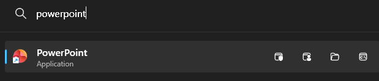
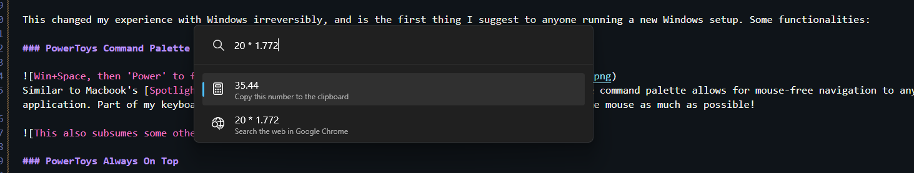
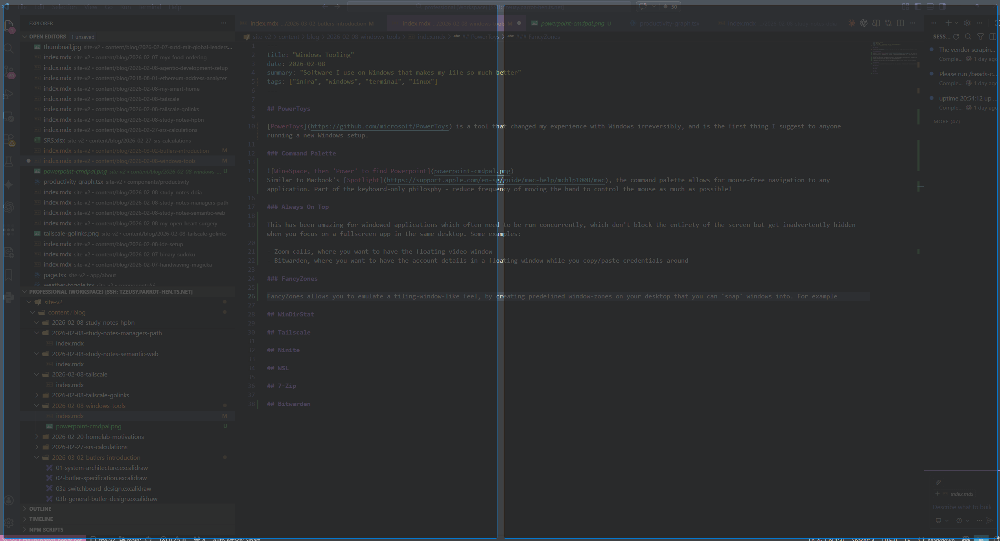
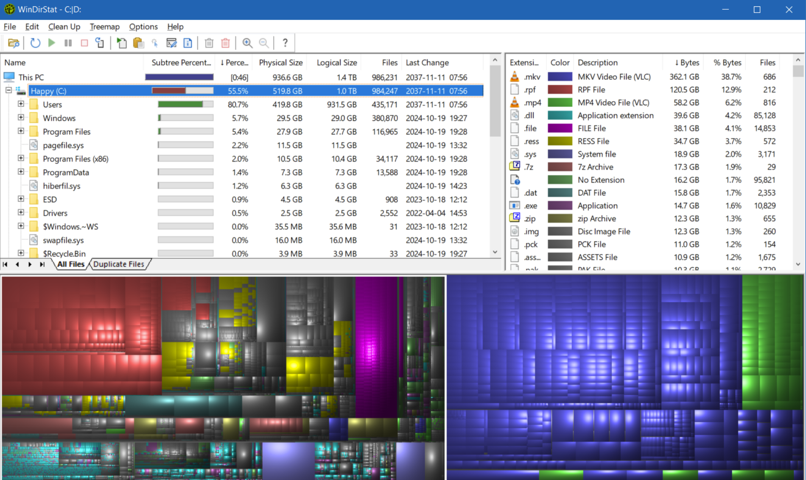
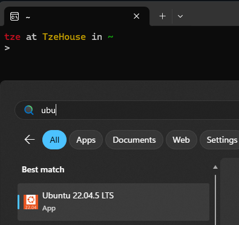

## [PowerToys](https://github.com/microsoft/PowerToys)

This changed my experience with Windows irreversibly, and is the first thing I suggest to anyone running a new Windows setup. Some functionalities:

### PowerToys Command Palette

Similar to Macbook's [Spotlight](https://support.apple.com/en-sg/guide/mac-help/mchlp1008/mac), the command palette allows for mouse-free navigation to any application. Part of my keyboard-only philosphy - reduce frequency of moving the hand to control the mouse as much as possible!

### PowerToys Always On Top

This has been amazing for windowed applications which often need to seen while another application is in focus. These don't usually block the entirety of the screen but get inadvertently hidden when you focus on a fullscreen app in the same desktop. Some examples:

- Zoom calls, where you want to have the floating video window
- Bitwarden, where you want to have the account details in a floating window while you copy/paste credentials around
- Message windows which can be shoved in the corner of a screen while some other fullscreen application runs

This is also amazing for keeping some of my applications (e.g. Spotify) visible during full-screen remote desktop sessions (e.g. for work).

### PowerToys FancyZones

FancyZones allows you to emulate a tiling-window-like feel, by creating predefined window-zones on your desktop that you can 'snap' windows into. For example, you can break your display into two 'halves' in which holding Shift while dragging a window allows you to easily resize it to fit half your screen.

## [WinDirStat](https://en.wikipedia.org/wiki/WinDirStat)

Ever had too much storage usage and no idea what to clean? WinDirStat helps you to visualize all usage.

## [Tailscale](https://tailscale.com/)

Every device I own exists on my private tailnet, exposing microservices that run in my homelab and allowing them to talk to each other. Everything from my Home Assistant to my Kubernetes services wire themselves seamlessly into the network. Some other nifty features like exit nodes, VPNs, and MagicDNS make this an amazing addition to my personal windows system.

## [Ninite](https://ninite.com/)

This you to install multiple applications upon bootstrap of a new Windows machine.

## WSL

WSL (Windows Subsystem for Linux) has been a pretty surprisingly good product (since WSL 2, at least), allowing me to almost-natively run Ubuntu on my Windows machine. There are still a few gaps - GPU support/compatibility being one of the biggest - but WSL allows me to do a bunch of experimentation and Linux-specific development without having to dual-boot Linux entirely. Admittedly, haven't used it as much ever since I started rolling my own dedicated Linux machine, but this is great for anyone who doesn't want to have to manage multiple OSes on multiple machines concurrently.

## 7-Zip

7-Zip has been a pretty good drop-in replacement for WinRAR (couldn't afford the payment honestly) for me.

## Bitwarden

Password management! This is also installed across all my devices, and has been great for password management and passkeys.

No pictures for this, obviously :-)
