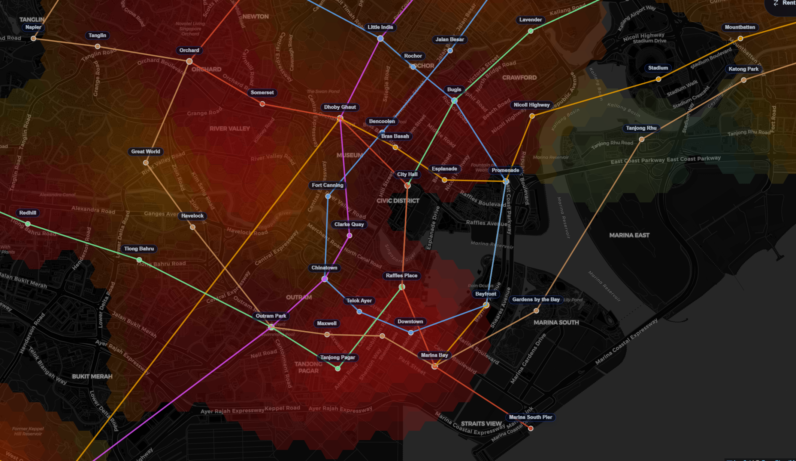

# Introduction

I've been casually keeping a lookout for properties over the past few months, as I've been considering moving out with my partner and our current work circumstances (working pretty close to each other around the Shenton Way area).

So - we have a problem statement!

- Are we looking to *rent* or *buy* a property?
- Where are we looking to stay, and for how long?
- What price are we willing to pay?
- How much do we value our time?
- What amenities are we looking for?
- How can we best get *a good deal*?

These questions individually affect each other, and have to be considered together. 

Maps I've found online all contain subsets of all the things I wanted to include in my search:

- Train stations and train lines
- Property locations (what are our buy/rent candidates?)
- Amenities (Shopping malls, supermarkets)
- Facilities (Gyms, pools, etc.)
- *Heatmaps* to quickly visually condense the 'value' of an area, relative to its 'cost'.

However, none of these were trivially aggregatable; not to mention, the underlying data had a fair amount of insight to it that simple UXes would not be able to surface for me. I hence got to work with the Unlimited LLM-provided Power I have at my disposal :-).

# The application

Play with it yourself at https://tze.how/sg-property-map/ - this is a statically exported subset of the full application, which includes a bunch of more personalized data (personal landmarks, listings aggregation, etc.). 

It first started off as a generic 'platform'-type of application; browse around tabs of listings, with a small map in the corner for navigation. Over the course of that exploration, however, I felt like the *map* itself was the most fun part of the experience - scrolling around, focusing on landmarks I recognized, estimating physical distances, were all things that the UX of a map could deliver far better than flat statistics depicted via 'distance' or 'lat/lon' tabular metrics. I hence rewrote it to be a primarily map-centered application!

Inspired by Cities: Skylines, I decided heatmaps were a good way to visualize various orthogonal concepts as a way of geospatially associating 'value' to locations. And of course as an avid Civilization player, the tiling had to be hexagonal in design! Three main orthogonalities:

- Price-per-Square-Foot (PSF): The average PSF of an area literally implies how much you're "paying" for every bit of area. High demand, high-density areas naturally command the highest PSFs; I want to know *how much more is it*, and what this *'convenience premium'* is.
    - Centrality aside, this can also be heavily affected by factors like types of housing; larger houses naturally have lower PSFs, as areas may not necessarily be fully 'livable'. We can't purely use PSF here without controlling for other factors (number of rooms, sqft area, etc.). 
- Transaction price: How much apartments go for. This [tends to make news](https://www.edgeprop.sg/property-news/five-room-flat-bukit-batok-was-just-sold-1059-million-setting-new-record-high-such-flats-town) whenever new records are set; they correlate with high-demand areas, but similar arguments to PSF apply in considering disparate values of locations (5 room flats obviously costing more than 4- room flats; does that mean locations with no 5-room flats are 'cheaper'?)
- Accessibility: A heuristic! We want to know how *close* this location is to everything: MRTs, bus stops, amenities, and the like. This is a strong consideration for most home-buyers; unfortunately, the things they prioritize aren't identical. For example:
    - Schools; people with young children would prioritize this, with emphasis on *good schools*
    - Hospitals; people with elderly parents would prize this more
    - Police Stations
    - Religious buildings
    - How do we allow them to tune heatmaps *for their personal priorities?*

## Tech Stack, data sources

<!-- TODO: deep-dive into property-agents and generate a table for this -->

## 