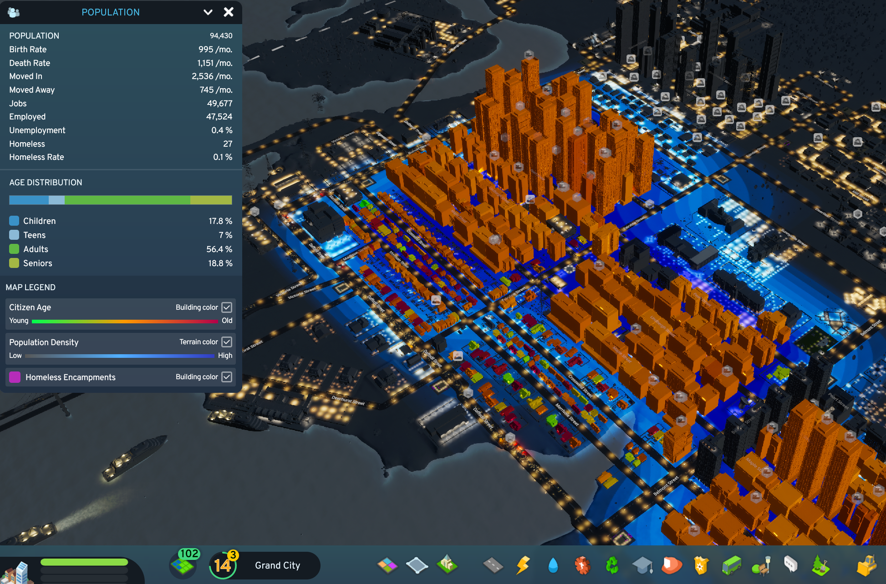
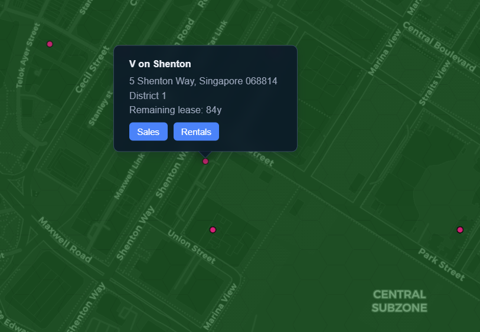
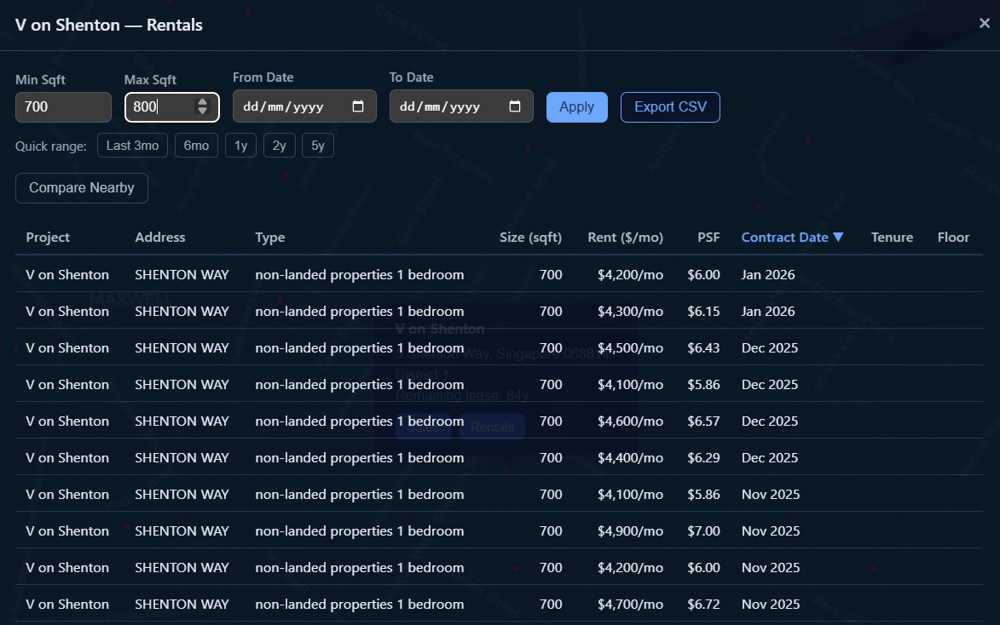
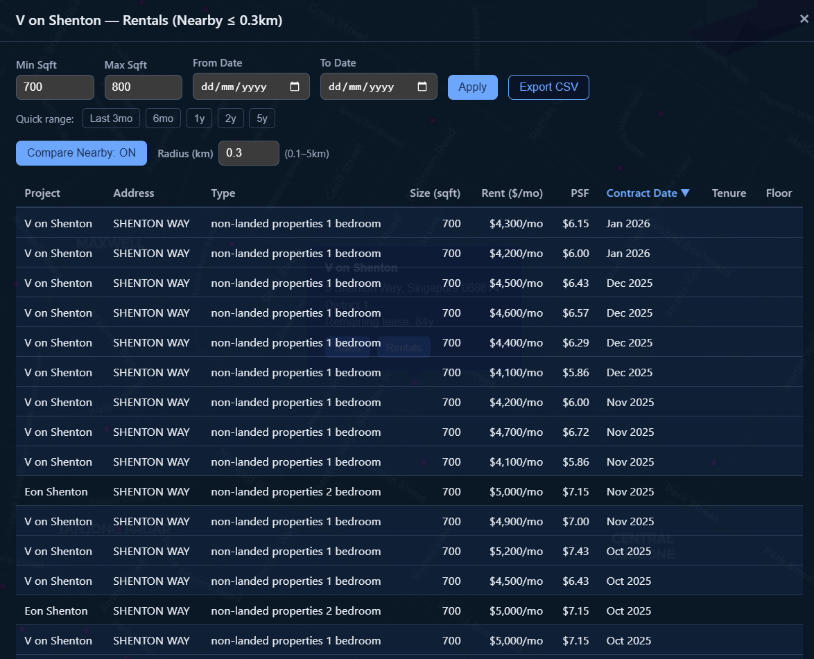

<Callout type="info">
TL;DR: Application link is [here](https://tze.how/sg-property-map/) - feel free to have a play! It's a little heavy and unoptimized, so it may not run well on weaker PCs sadly.
</Callout>

## Introduction

I've been casually keeping a lookout for properties over the past few months, as I've been considering moving out with my partner and our current work circumstances (working pretty close to each other around the Shenton Way area).

So - we have a problem statement!

- Are we looking to *rent* or *buy* a property?
- Where are we looking to stay, and for how long?
- What price are we willing to pay?
- How much do we value our time?
- What amenities are we looking for?
- How can we best get *a good deal*?

These questions individually affect each other, and have to be considered together. A bunch of research goes into this work:

1. Public transport is a big part of daily life; where are the nearest train stations to all of my landmarks (work/home/parents'/partners' etc.)?
1. Where are the nearest amenities? What is my 'supermarket' run going to look like?
1. How long does it take to get to work every day?

How do we answer all of these questions *systematically* rather than on an ad-hoc, per-location basis? Maps I've found online all contain subsets of all the things I wanted to include in my search:

- Train stations and train lines
- Property locations (what are our buy/rent candidates?)
- Amenities (Shopping malls, supermarkets)
- Facilities (Gyms, pools, etc.)
- *Heatmaps* to quickly visually condense the 'value' of an area, relative to its 'cost'.

However, none of these were trivially aggregatable; not to mention, the underlying data had a fair amount of insight to it that simple UXes would not be able to surface for me. I hence got to work with the `Unlimited LLM-provided Power` I have at my disposal :-).

## The Application

*Access it [here](https://tze.how/sg-property-map/)*

<Callout type="info">
This is a statically exported subset of the full application, which includes a bunch of more personalized data (personal landmarks, listings aggregation, etc.). It was important to me that this could be fully statically rendered, so it can be served on GitHub Pages without me having to run a dedicated server.
</Callout>

### Tech Stack, data sources

| Layer | Technology | Role |
|---|---|---|
| **Language** | Python 3.12 | Backend, pipelines |
| | TypeScript 5.9 | Frontend |
| **Web Framework** | FastAPI | REST API + health endpoints |
| | GitHub Pages | For Static Site (no FastAPI/DB) |
| **Frontend** | React 19 + Vite 7 | Map-centered SPA |
| | React-Leaflet 5 / Leaflet | Interactive map rendering |
| | leaflet.heat | Hexagonal heatmap overlays |
| | @tanstack/react-table | Tabular data views |
| **Database** | PostgreSQL (asyncpg) | Canonical property store |
| | SQLAlchemy 2 + Alembic | Async ORM + migrations |
| **Geodata** | OneMap API | Singapore government geocoding |
| | OpenStreetMap Nominatim | Geocoding fallback |
| | pyproj + pyshp | Coordinate projection + shapefiles |
| **Government APIs** | URA | Rental + Transaction data |
| | HDB | Rental + transaction data |
| | data.gov.sg | Open data (amenities, POIs) |
| | LTA DataMall | MRT stations, bus stops |
| **Scheduling** | APScheduler | Cron-based pipeline runs |
| **Observability** | OpenTelemetry → Grafana (Loki, Tempo) | Distributed tracing + structured logs |
| | structlog | Correlated structured logging |
| **Deployment** | GitHub Pages | Static Site |
| **Package Management** | uv | Fast Python dependency resolution |
| | Bun | Frontend package management |

## Project Design

It first started off as a generic 'platform'-type of application; browse around tabs of listings, with a small map in the corner for navigation. Over the course of that exploration, however, I felt like the *map* itself was the most fun part of the experience - scrolling around, focusing on landmarks I recognized, estimating physical distances, were all things that the UX of a map could deliver far better than flat statistics depicted via 'distance' or 'lat/lon' tabular metrics. I hence rewrote it to be a primarily map-centered application.

### Data Ingestion

This is a data aggregation/normalization + visualization project. We want to fetch various data sources (N data pipelines) and present it in a usable way on our pretty frontend map. Having worked in data engineering for most of my professional career, there were many lessons to intuitively incorporate into the design:

- Extract-Transform-Load (ETL): Keeping raw data and transformed data separately.
- Timeseries data: Not *too* critical here, but a more heavily productionized setup would emphasize this more.
- Checkpoints for easy resumption (e.g. Location download -> Geocoding not being tightly coupled)
- Layered caching to respect rate limits of upstream services, and to avoid redundant duplicate requests

To that end, we have ingestion flows for different data sources!

<ExcalidrawDiagram light="amenities-light.svg" dark="amenities-dark.svg" alt="Amenities are drawn from data.gov.sg and Wikipedia, with healthy rate limit respecting and geocoding embedded within the pipeline." />

<ExcalidrawDiagram light="geocoding-light.svg" dark="geocoding-dark.svg" alt={`All data sources without explicit latitude/longitude go through a geocoding processing stage, relying on OneMap and Nominatim to generate estimated lat/lon values. I've found this is sometimes wrong; was very fun investigating why "Lot 1" showed up next to the Esplanade... hence we now have an override layer for explicit examples of places where "we know better."`} size={100}/>

## Visualization

The frontend was built to revolve around a map as the central UI component, akin to Google Maps but with an explicit 'property-search' concern. All of the abovementioned ingestion flows are incorporated here through various filters. My intended core feature of this is the *heatmap* - a series of heatmaps that allow us to visualize relative 'value' of locations!

Inspired by Cities: Skylines, I decided heatmaps were a good way to visualize various orthogonal concepts as a way of geospatially associating 'value' to locations. And of course as an avid Civilization player, the tiling had to be hexagonal in design! Three main orthogonalities:

- Price-per-Square-Foot (PSF): The average PSF of an area literally implies how much you're "paying" for every bit of area. High demand, high-density areas naturally command the highest PSFs; I want to know *how much more is it*, and what this *'convenience premium'* is.
    - Centrality aside, this can also be heavily affected by factors like types of housing; larger houses naturally have lower PSFs, as areas may not necessarily be fully 'livable'. We can't purely use PSF here without controlling for other factors (number of rooms, sqft area, etc.).
- Transaction price: How much apartments go for. This [tends to make news](https://www.edgeprop.sg/property-news/five-room-flat-bukit-batok-was-just-sold-1059-million-setting-new-record-high-such-flats-town) whenever new records are set; they correlate with high-demand areas, but similar arguments to PSF apply in considering disparate values of locations (5-room flats obviously costing more than 4-room flats; does that mean locations with no 5-room flats are 'cheaper'?)
- Dynamic heuristics! We want to know how *close* this location is to everything: MRTs, bus stops, amenities, and the like. This is a strong consideration for most home-buyers; unfortunately, the things they prioritize aren't identical. For example:
    - Schools; people with young children would prioritize this, with emphasis on *good schools*
    - Hospitals; people with elderly parents would prize this more
    - Police Stations
    - Religious buildings
    - How do we allow them to tune heatmaps *for their personal priorities?*

### Dynamic Radar Chart

Now that we have identified a series of priorities which different people prioritize, we can do clever things with it! The idea here is to generate a value for each property based on its proximity to various amenities, multiplied by users' individual preferences. The former two are static datasets, while the latter is user-specific data. We turn to matrix multiplication for this. A pre-computed matrix can be generated for every category that we define - this can be as specific as "proximity to amazing primary schools" where only good primary schools have weights. This matrix can then be dot-producted with user preferences (if user cares about these primary schools, score++) to generate aggregated scores.

<ExcalidrawDiagram light="accessibility-heatmap-flow-light.svg" dark="accessibility-heatmap-flow-dark.svg" alt="Accessibility heatmap scoring flow" />

$$
\text{score}(z) = \sum_{i} \hat{w}_i \cdot s_{z,i}
\quad \text{where} \quad
s_{z,i} = \sum_{f \in F_i} v_f \cdot d(z, f)
\quad \text{and} \quad
\hat{w}_i = \frac{w_i}{\sum_{j} w_j}
$$

- $s_{z,i}$ -- aggregated signal for zone $z$ and facility family $i$ (precomputed)
- $v_f$ -- value weight of individual facility $f$ (e.g. a top-ranked primary school scores higher than a less popular one)
- $d(z, f) \in [0, 1]$ -- distance-decayed proximity from zone $z$ to facility $f$
- $w_i \in [0, 100]$ -- user weight for family $i$ (from the radar chart)
- $\hat{w}_i$ -- normalized weight, excluding zero-weight families

Or in matrix form for all zones at once: $\textbf{scores} = S \cdot \hat{\textbf{w}}$, where $S$ is the precomputed zone-by-family signal matrix and $\hat{\textbf{w}}$ is the normalized user weight vector.

What's more, to optimize for computation, a significant chunk of this can be pre-computed! Every property, multiplied by every distance/value of each amenity, is data we hold on the backend - a one-off matrix can be generated and statically served for heatmap purposes. In addition, for the purposes of a heatmap, this can be pre-aggregated into *heatmap zones* instead of exporting one data point for every single property. This allows for something that would be typically *very expensive* to instead be periodically generated on the backend as we introduce different categories.

We hence can allow users to tune *how much they value each category* in a radar chart - which dynamically influences the color of their generated maps in Singapore. For example, for a user that *really, really values police presence*, we can see how the heat map prioritizes zones near to police stations:

This approach allows for *user-defined generation of valuable locations in Singapore*. For example, here's my own - weighing schools and childcare very low, because I don't have any children yet:

I also took a few liberties to generate a few custom matrix-overlays for some common categories: `centrality` (distance to the center), `good-pri-schs` for proximity to a top-ranked primary school, `malaysians` for proximity to the Tuas/Woodlands checkpoints.

Best of all - it's a static site, with no backend state persisted server-side! Though it might not run very well on potato PCs...

<Video src="heatmap-variation.mp4" caption="Dynamically adjusting heatmap weights based on user preferences" size={200}/>

The end state is that we have a map whose weights dynamically update per the user's preferences, allowing for customized views of exactly what regions in Singapore would be ideal for their requirements.

### Transaction Lookup

Next up I wanted to tackle the problem of historical data lookup. There's plenty available from URA and HDB, but having to query them all one by one in their rather unwieldy UXes was a pretty poor way of figuring out what houses we wanted to buy.

Why not embed this information into our map?

Another question I had was, what about a location-approximate comparison? How much are condominiums in the same area charging for the same set of constraints?

## Current State

Using this map I've managed to identify several 'target zones' with ideal characteristics. Ironically, we decided to go for a rental nearby our workplaces so a lot of this became a little irrelevant. However, when we do go for a purchase, this is a resource I'm going to be relying on in my search. There's some more work to do in searching for listings...

### Related (Future?) Work

A big potential feature-space is *listings data*. Various sites (PropertyGuru, 99.co, edgeprop, etc.) work as marketplaces for property agents to list properties for rent or for sale. This was actually the initial idea for the project; however, this tends to venture into legally gray areas with web scraping and various sites' TOS-es. Perhaps I'll explore this more as the project matures :)

### Bloopers

