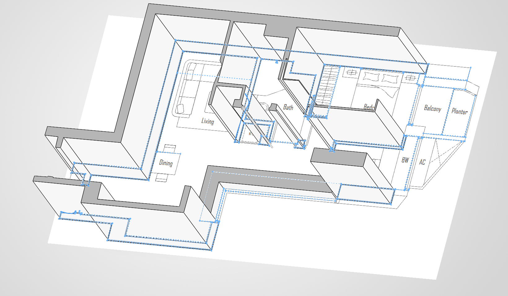
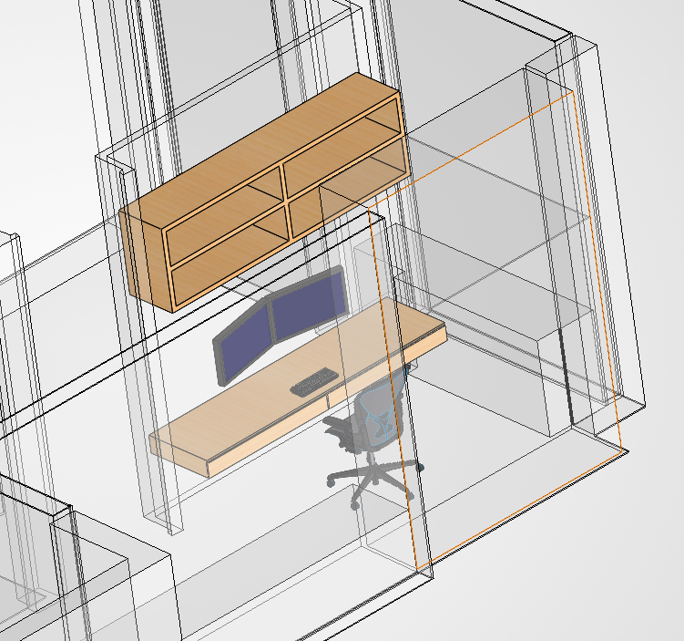

<Callout type="info">
This is a bit of a departure from my usual posts - 3d modelling isn't really related to my day job :-) but it's a skill I picked up in SUTD, and this seemed like a great opportunity to exercise that muscle a little
</Callout>

## Introduction

## Process

