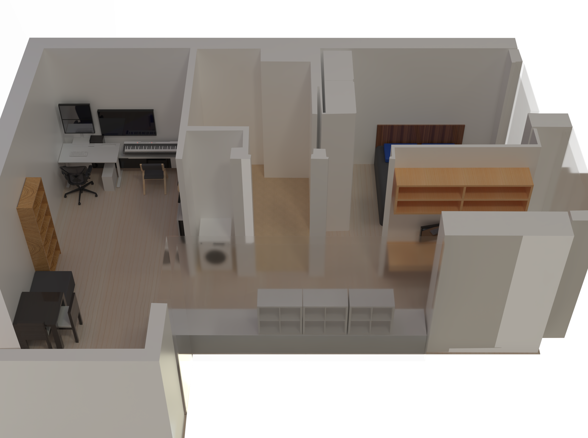
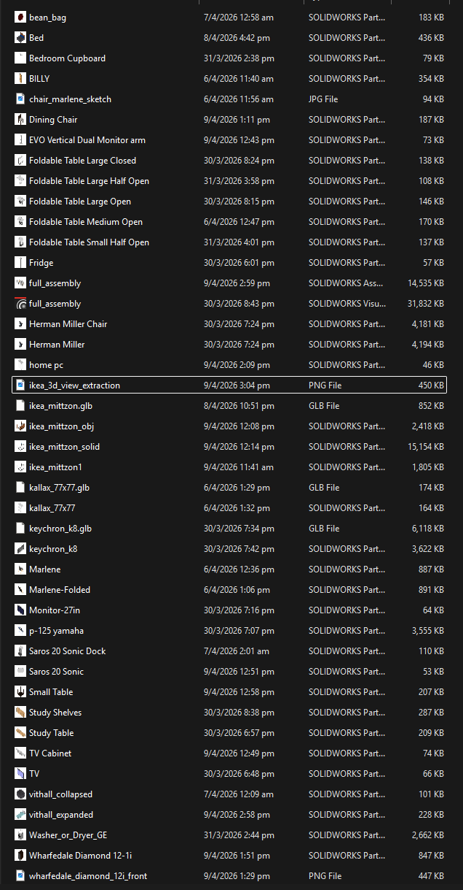
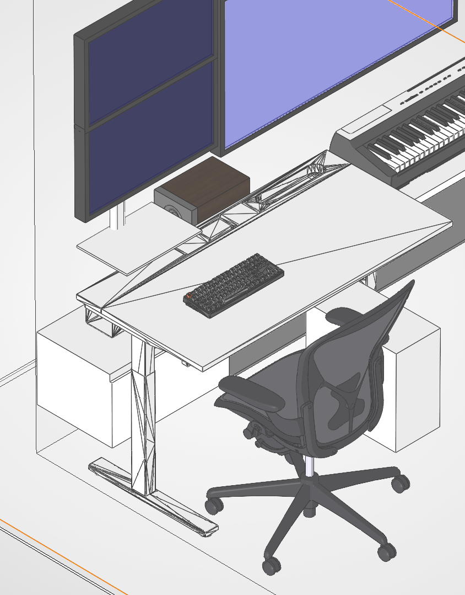
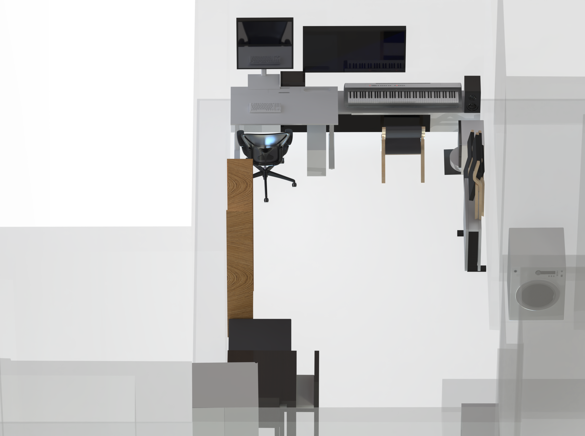
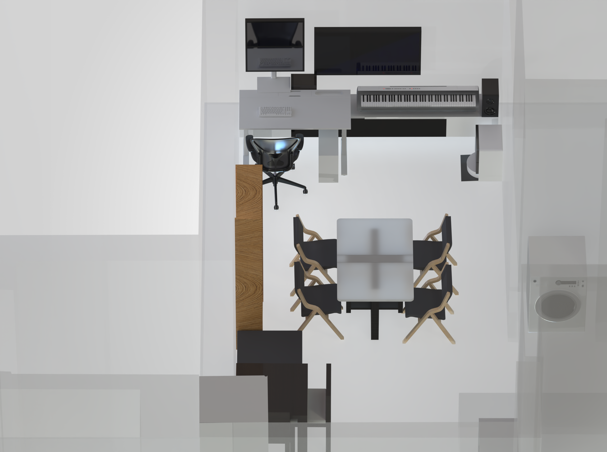

<Callout type="info">
This is a bit of a departure from my usual posts - 3D modelling isn't really related to my day job :-) but it's a skill I picked up in university, and this seemed like a great opportunity to exercise that muscle a little.
</Callout>

## Introduction

After having done a bunch of house hunting (see my [property-hunt](/blog/property-hunt) post), my partner and I settled on a condo near our workplaces. After a several-week process of reaching out to property agents and going for viewings (can't digitize this yet, unfortunately!), we made an offer for a 1BR + study apartment in V on Shenton. The next mini-project became clear then: planning furnishings and layouts of our upcoming house!

There are several considerations to be made, given that this is a 2-year rental arrangement and not a 'forever home':

- No permanent fixtures are allowed
- No wall mounts, or smart switches, etc.; any 'smart home' functionality has to be noninvasive (e.g. IR emulation)
- It should be robo-vacuum friendly to save us lots of cleaning trouble
- Wiring is already done up so there are no networking or cabling decisions to be made (sadly)
- We'll often have to have both of us working at the same time; our setup needs to accommodate that

There are several problems with answering our questions:

- How do we know whether our (relatively small) study room can fit two working setups?
- How do we know how any proposed furniture will look before we buy it? Will it even fit in the space that we theorize?
- How will different 'arrangements' of furniture look? How can we visualize this *without* buying and physically rearranging everything?

Typically the answer would be to pay an interior designer some lavish sum and get artists to do mockups. But I'm an engineer with some amount of free time! So here we go :-)

## Process

The 'right' approach to do this would probably be a combination of Blender and 3DS Max - honestly, if I was starting this from scratch with no skill background I'd do it this way. However, during my time in SUTD I did plenty of 3D modelling in SolidWorks - their education license stickiness strategy has worked! - so SolidWorks became my lowest-friction, lowest-barrier-to-entry way of solving this (estimating a few hours in SolidWorks vs. likely a few days of UX learning on other platforms). 

It's pretty clear that SolidWorks isn't the best software for this; it's meant more for electro-mechanical engineering tasks than for interior design. However, it's enough for me! The main things I need:

- Ability to combine multiple components (SolidWorks assemblies)
- Ability to 'project' images (floor plans) and trace contours/edges
- Ability to design individual components based on dimensions I can farm from different sources (e.g. furniture spec sheets)
    - In the far future - LLM support :-( to auto-generate components
- Basic visualization capabilities (Honestly SolidWorks Visualize is pretty disappointing so far....)
- We only really need to focus on spaces where there are significant design choices to be made; no real need for toilet or bedroom modelling given the limited space and furnishing options
- Ability to leverage existing community-made components (e.g. Herman Miller chair 3D models), while checking individual usage licenses

### Community Parts

Happily, I was able to find many fitting 3D models already built online - for example:

- [Herman Miller Aeron](https://grabcad.com/library/herman-miller-aeron-chair-1)
- [Washer/Dryer](https://grabcad.com/library/washer-or-dryer-1)
- [Yamaha P125 Digital Piano](https://www.cgtrader.com/free-3d-print-models/gadgets/audio/piano-yamaha-p125)

This made it much easier to create correctly scaled (and good-looking!) representations in our model.

### Apartment

We begin by taking the floor plan - in this case, it's conveniently available from the [V on Shenton floor plan page](https://www.v-on-shenton.com/floor-plan.html) (which listed 1-bedroom + study unit types when I checked on 2026-04-06). We also did a bunch of physical measurements during one of our viewings so we could scale the floor plan to the correct dimensions for a proper scale model (see the `<----- 280.00 ----->` line in the living room).

### Furnishings

Every piece of existing/proposed furniture without a downloadable 3d model needed to be modelled with appropriate textures and **accurate dimensions**. This is the bulk of the tedium in the work; to avoid boring you, I'll simply show the process for one particular piece: the [FortyTwo Marlene foldable chair](https://www.fortytwo.sg/marlene-foldable-chair.html).

## Scenarios

Having built all our components, we can now dynamically rearrange parts in our assembly by assembling them and moving them around!

<video controls loop muted playsInline src="chair-rotation.mp4" />

### Arrangements

After creating necessary assets, we can arrange them in our apartment!

## Results

The end result is a fully re-arrangeable virtual house, with visualizations trivially possible, and full dimension predictability for every piece of furniture without having to make possibly *really* expensive mistakes.

 can unfold into a cosy bed...](vithall_expanded.png)

### Learnings

Given that I've done this before for my current room, I wouldn't say there was a lot of *learning* to be had here; this is more of a leverage-existing-skills kind of project, which I ended up relishing all the same; it's always pretty cool to show people 3D renderings of our proposed furniture arrangements!

The total time taken would be on the order of about 10 hours, not including writing this blog post? With measurements, research/modelling of parts, and making multiple tentative rearrangements throughout discussions with my partner. While it isn't *the best* use of time possible, I was happy to do this as Claude/Codex churned away at other projects of mine in the background :-) at least there's still some viable work left for us human plebs.

## Mini side project to this side project

<Callout type="info">Due to time constraints I didn't get too far on this project; sadly, this is a bit too far from an MVP to deserve a blog post of its own... prototype code is public at [viz-on-shenton](https://github.com/Tzeusy/viz-on-shenton).</Callout>

In theory, nothing's really stopping one from simply *uploading* a floor plan and getting an LLM to handle visualizing layouts and interacting with the user throughout. In practice, this still wasn't trivial to build robustly in my tests: everything from furniture design (significant back and forth with an LLM to confirm dimensions, textures, shape, etc.), to lighting, to generating 3D models, to placing 3D models within 3D models needed much more glue code than expected.

Some initial experimentation (1-2 hours) looked promising, but showed that *a loooooot more work* was needed - likely on the order of weeks to months for solo-dev-me, even with LLM assistance. I hence decided to fall back to my tried-and-true method of modelling it myself - sad but the `Technology Just Isn't There Yet`.

## Wrap-up

This project did exactly what I needed for this rental: fast "will this fit?" iterations before spending money on furniture, plus a clearer view of tradeoffs in the study and living room. If I revisit the automated route later, I'll likely keep this manual model as the reference baseline to evaluate generated outputs against.

We haven't started our lease yet; when we do, and when everything is fully set up, I will update this post with comparison pictures between our renderings and our reality :-).