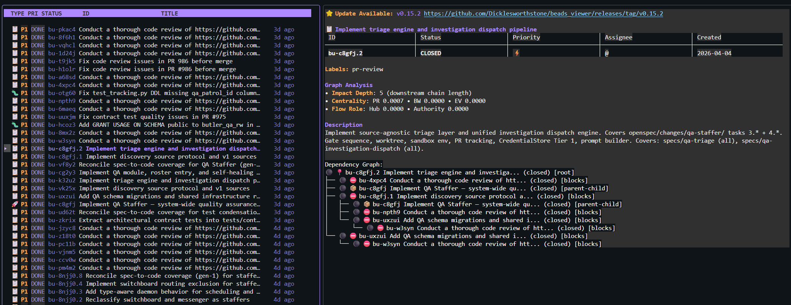

<Callout type="info">
This is a series of Developer Experience- type posts where I document my local LLM setup for managing of subagents for personal projects. These are snapshot-type posts; I may update this over time as my tooling evolves.

Next post link: [Custom Tools](/blog/llm-custom-tools)

Last updated: 2026-04-10
</Callout>

## Delivery: Managing An Orchestra of Workers

Funnily, this was actually how I started on my journey of LLM CLIs: I read about Steve Yegge's [Gas Town](https://steve-yegge.medium.com/welcome-to-gas-town-4f25ee16dd04) on a plane and spent the flight thinking about the multiplicative implications. The motive here is simple: we have a ridiculously powerful LLM at our fingertips, and it's doing really well with *one of me*; how do I run multiple copies of the LLM, while keeping one of me, while keeping everything logically consistent, without having them step on each others' toes?

<Callout type="warning">Steve isn't joking when he says Gas Town is a massive token guzzler; I tried Gas Town for a week or so, but quickly realized it was exhausting my budget far faster for much less output-per-token than my own self-rolled orchestration workflows. It's probably more productive overall; but it was overwhelming my Claude Max 20x + Codex Pro subscriptions, and I felt that $600 a month was already too much to pay as an individual :-).</Callout>

Given that I wasn't going to spend more than $600 a month on personal AI (and in a period of work, only intending to spend $300/month), I had to figure out how to roll my own orchestration stack, that's hopefully a bit more efficient. As it turns out, most of the components involved here are already solved problems in existing systems today.

- Running multiple LLMs is trivialized with terminal tools like `tmux`; getting one LLM to run other LLMs was supported in mid-2025 for Claude, 2026 for Codex.
- Task ordering is solved with [Directed acyclic graphs](https://en.wikipedia.org/wiki/Directed_acyclic_graph) in job schedulers like Airflow, as long as we can figure out a reliable way to chain dependent jobs
- Giving agents dedicated playgrounds is solved by [git worktrees](https://git-scm.com/docs/git-worktree)

Primitive implementations for getting orchestration working with agents is simply a task of wiring up implementations of all of the abovementioned concepts in the right order. There are several problems that we can additionally explore:

- Model tiers for different subagents for tasks of different complexity (worst case; run everything with Opus, hah)
- Reconciliation tasks to valid the outputs of unsupervised agents
- PR review workflows for additional code safety

But these are implementation details, and not architectural constraints. This is where I split "direction" from "delivery". The [`project-direction`](https://github.com/Tzeusy/ai-bootstrap/blob/main/skills/personal/project-direction/SKILL.md) skill is responsible for deciding what the project should work on next: reconcile doctrine, reconcile specs, synthesize a coherent OpenSpec change, and then generate an acyclic work graph based on Steve Yegge's [Beads](https://github.com/steveyegge/beads). Its output is an execution-ready plan.

### The Writer

Given a set of specifications, work is planned using the [beads-writer](https://github.com/Tzeusy/ai-bootstrap/tree/main/skills/personal/beads-writer) skill, which walks an LLM through the various steps needed for scoping out necessary work, chaining between each other via dependencies it in an acyclic manner, and planning reconciliation and review cycles. This writer tries to encourage several best practices:

- Spec driven documentation, using targeted sections of normative specs (see `/spec-and-spine` from the previous post) in addition to the current bead's instructions to influence an LLM's development process
- Dedicated reconciliation beads that allow independent agents to reconcile normative specs and generated code, and to identify gaps to plan future work if necessary
- Task complexity allowing dynamic model selection
- Splitting of work into modular chunks that are easier to reason about within context

The magic of using an asynchronous flow of task planning and task execution is that they become separately managed queues; while beads are being worked on, I can happily work on generating *more beads*, and trust that workflows are not inherently contradictory.

### The Coordinator

The work plan goes to [`beads-coordinator`](https://github.com/Tzeusy/ai-bootstrap/blob/main/skills/personal/beads-coordinator/SKILL.md). The coordinator is the live execution layer. It runs cleanup, looks at `bd ready`, selects the highest-priority unblocked work, creates isolated worktrees, and dispatches workers for the bead in front of it. If there is a waiting PR-review bead, that lane takes precedence. If there is simple direct-merge work, it handles that path too. Its scope is orchestration.

I like this split because it prevents planning from getting contaminated by execution convenience. The directioning layer asks "what is coherent, aligned, and worth doing?" The coordinator asks "given that plan, what can safely move right now?" They are related questions with different responsibilities.

In a way, this emulates [Gas Town](https://github.com/steveyegge/gastown)'s Deacon, but in a much less token-expensive manner. Being able to explicitly control this (this is just a skill invocation, after all) allows me to better manage the rate at why my project burns through tokens; though I have to admit that I do miss the Gas Town Mayor a bunch...

### The Worker

[`beads-worker`](https://github.com/Tzeusy/ai-bootstrap/blob/main/skills/personal/beads-worker/SKILL.md) is deliberately much narrower. A worker gets one bead, one branch, one worktree, and one bounded objective. It stays inside that issue boundary, implements the change, runs the quality gates, and hands back a structured report.

That constrained contract matters a lot. It means the implementation agent is optimized for delivery. The worker can read Beads state for context, while the coordinator owns lease renewal, dependency wiring, blocker creation, PR-review bead creation, and closure. The workflow stays legible because each role has a sharp boundary.

This is also where the worktree discipline earns its keep. Every file read, edit, test run, commit, push, and PR command happens inside the worker's isolated checkout. That one rule eliminates an enormous amount of cross-agent foot-gunning. The worker is meant to be boring in the best possible way: scoped, verifiable, and hard to confuse with a free-roaming coding session.

### The Reviewer

In the Beads model, that role is handled by [`beads-pr-reviewer-worker`](https://github.com/Tzeusy/ai-bootstrap/blob/main/skills/personal/beads-pr-reviewer-worker/SKILL.md), which is dispatched only for dedicated `pr-review-task` beads. It has a stricter job: identify the original implementation bead, resolve the linked PR, rebase it onto the latest base branch, inspect unresolved review threads and code deltas, apply or request fixes, and only merge if a fairly hard set of guards passes.

The goal of these guards is to introduce a quality-gate layer via LLM supervision: the PR is ready for merge, unresolved review threads are zero, required checks are green, merge state is clean enough, and the review leaves a visible audit trail. Otherwise, the reviewer keeps the review bead blocked and the system goes around again. I've observed that it's very important to have independent LLM sessions vet each others' output, rather than having one session run through implementation-review prompts; context poisoning leads to far more agreeableness with "an LLM's own code". 

## Conclusion

With the project-shape and the project-direction flows specced out, we now have a harness around any LLM CLI that can be used to plan and autonomously drive deep cycles of implementation work, turning deep brainstorming sessions of ideas into implement