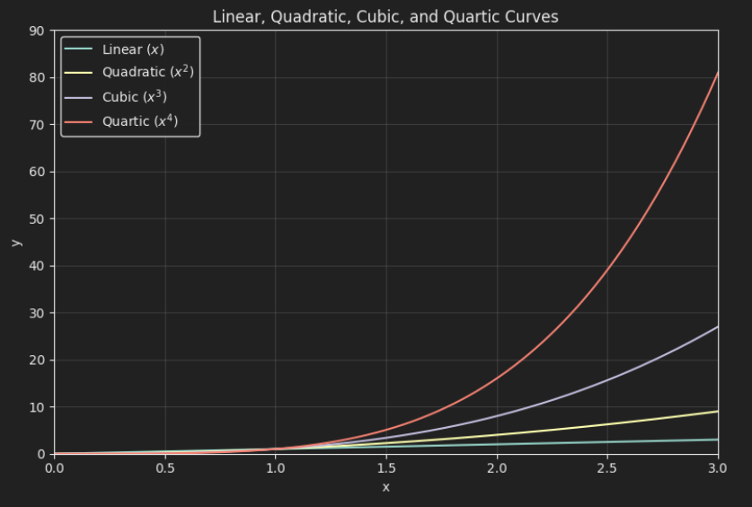

<Callout type="info">
This is a timeline/reflective post; notes on my personal setup ('dotfiles', if you like) can be found in [My AI Setup](/blog/my-ai-setup).
</Callout>

## Overview

I've been pretty enthusiastic about the potential for AI, keeping up with latest releases and gradually growing usage of GitHub Copilot into my daily workflow since early last year. Last year, using independent agents to aid in my development process, I derived significant time savings from instructing individual instances of Claude Sonnet to do things like refactor files, write tests, or explain small-scope changes. I'd frame this as something of a 20% savings in time, and generally improved visibility over my workplace's production infrastructure.

<Callout type="tip">
Ye olde days: basic iteractive steps for development were...
- Project planning
- Decomposition into constituent steps
- Per step, run cycles of [Implement, Test, Validate]
- Synthesize/review/merge/release
</Callout>

Up till this point, AI usage was extremely focused; given a problem, all the tasks of development were still user-side, with end to end project management done by me but with assistive agents for individual subtasks. Sonnet was good at writing functions and perhaps fanning out to retrieving `<10` files of context; anything more and the context degradation would significantly erode its output quality. 

This degradation essentially prevented anything but the most simple 'loops' from achieving liftoff velocity, as models get worse as their contexts bloated up. It was still pretty *great*, mind; just limited workflows to a very user-in-the-loop back-and-forth style of development.

**This got significantly overhauled with a [step function leap](https://x.com/karpathy/status/2026731645169185220) in agentic capabilities in November/December 2025.**

<Callout type="quote" cite="Simon Willison" hyperlink="https://youtu.be/wc8FBhQtdsA?si=ffShvZbvgV84W3XF&t=264">
In November, we had [...] the inflection point, [...] where previously if you had these coding agents, you could get them to write you some code, and most of the time it would mostly work, but you had to pay very close attention to it, and suddenly we went from that to almost all of the time it does what you told it to do, which makes all of the difference in the world.
</Callout>

My experience has been pretty much in line with these claims. I'll have to give credit to these primary reasons:

- Model evolution: The generation of (Claude Opus 4.5 and Claude Sonnet 4.5, ChatGPT's 5.1) tippoed over a threshold of usability
- Harnesses: Codex finally became usable, and Claude Code mature enough, that the experience using these CLIs with the latest-gen models above started becoming *pleasant*; often being even better than IDE development

Up till this point I hadn't thought it *possible* that my workflow would curve to the terminal so drastically; I'd been a staunch IDE user prior, using `vim` primarily only for investigative workflows and VSCode/IntelliJ for development otherwise. However, in the past two months, I've found that my IDE has been almost relegated to be simply a text-viewer, with development being primarily driven through agentic sessions on my terminal.

Since I started going all-in on AI usage about 2 months ago, my workflow has rapidly evolved; I'm writing this post to write check-in notes on my thoughts so far.

## General Principles

It's useful to think in terms of *derivatives* when looking at the landscape of AI-driven development. Let's use movement of objects as an analogy:

- *Position*, $x$: The code that is generated, underlying the software running in our systems day-to-day.
- *Velocity*, $v = \dot{x}$: The speed at which we write code, with all its ensuing requirements (testability, reliability, visibility, etc. etc.).
    - Prior to AIs, the *speed of writing reliable code* was a strong marker for the productivity of an engineer. This directly impacts their ability to deliver on projects.
    - How did we improve this before? Tooling (IDEs, terminal optimization, bash script familiarity, documentation clarity) and library familiarity to abstract away large modular subsets of work into repeatably reusable components.
- *Acceleration*, $a = \ddot{x}$: The speed at which we grow faster at writing code.
    - Prior to AIs, this was an implicit factor in the ability of communities to grow; network effects of things like language popularity (Python's explosive growth).
    - How did we improve this before? Mentality (keeping an open mind, always being eager to learn more tooling), working in ecosystems with large open source communities

So on, and so forth. These are *quadratic/cubic/quartic* curves, and every step on each ensuing curve has a *massive* impact on the output. Each independent layer has a multiplicative effect, so you can multiplicatively stack two quadratic curves to get a quartic effect.

<Callout type="info">Fun little segue: [Similar problem](https://adventofcode.com/2022/day/19) where you need to optimize ore mined by building various tiers of miner-generating miners</Callout>

### Derivatives, for thee: How is Anthropic 10x-ing their revenue every year?

Now let's frame this in the LLM landscape:

*Code generated per year* = *Total LLM data center inference capacity* (assuming they are running at full capacity)

Where data center capacity is a function of:

- Rate of growth of data center buildout, which has positive velocity and positive acceleration, constrained by energy availability and customer demand
- Tokens-per-watt efficiency of models
- Retained code-per-token is a function of the *quality* of the output of the model. Also note that model capabilities in general enable use cases which further enables demand.

In essence, the equation is

$code = \frac{code}{token}/\frac{token}{watt}/\frac{watts}{datacenter} * n_{datacenters}$

$\frac{token}{watt} = token/(\frac{watt}{hardware} * n_{hardare})$

$n_{datacenters} = energy/\frac{energy}{datacenter}$

Given the equations, it is easy to see why we are seeing a runaway explosion in code generation. Multiple factors are *compounding*:

- `energy-available` is compounding: [Solar energy is getting exponentially cheaper](https://ourworldindata.org/data-insights/solar-panel-prices-have-fallen-by-around-20-every-time-global-capacity-doubled)
    - Not independent, so I'll file this as a subset of energy: `number-of-hardware` is compounding (exponentially for now): [Data center growth per year](https://www.jll.com/en-us/insights/market-outlook/data-center-outlook#:~:text=Nearly%20100%20GW%20of%20new,of%20leasing%20and%20self%2Dbuilding.)
- `code-per-token` is compounding: Models are getting [exponentially more capable](https://metr.org/blog/2025-03-19-measuring-ai-ability-to-complete-long-tasks/) at translating token output into usable code
- `watt-per-hardware` is (at least linearly) improving: Research like [TurboQuant](https://research.google/blog/turboquant-redefining-ai-efficiency-with-extreme-compression/) are allowing larger models to fit into the same size of hardware
- `token-per-watt` is (at least linearly) improving: [LLaMA analyses](https://arxiv.org/pdf/2310.03003)
    - Caveat: Based on private provider pricing this doesn't seem to be the case, given how later models of GPTs and Claudes are more expensive than the last; but there are confounding factors here like volume of hardware needed, which make it hard to estimate tokens-per-watt from provider pricing

We have numerous compounding effects combined with commercial usefulness (supplying capital availability/market demand) that unlocks the immediate `vertical-upwards-line sigmoid` part of the [innovation adoption curve](https://en.wikipedia.org/wiki/Diffusion_of_innovations). 

### Derivatives, for me

Given the *arsenal* of developments improving the landscape happening right now, we ourselves have our own levers that we can pull to add further multiplicative effects to the efficacy of our code generation. Assuming an LLM can generate code 100x faster than a human:

- Using LLMs: We go from 1x to 100x amount of code, multiplied by (code efficiency factor) (say it's 95% inefficient; that's 5x code left)
- Using *tools* improves the capabilities of LLMs, improving efficiency:
    - Open source/commercial tooling improves year-on-year (positive velocity, positive acceleration)
        - Claude Code, Opencode, Codex
    - Protocol upgrades (introduction of agent skills, MCPs)
    - Leverage inherent within protocols (skills maturing over time, skills that write skills, etc.)
- Frameworks that better orchestrate and instruct LLMs further improves efficiency of LLMs
    - More directed work in line with user intent
    - Rigorous testing for fewer iterations
- Horizontal scaling (subagents) adds a linear multiplier to individual user productivity

It hence becomes *paramount* that any developer in this AI adoption curve leverages the factors within our control. It's also important to work on things that are *orthogonal* to external factors, so our work today is similarly extendable to the models and infrastructure of tomorrow.

<Callout type="info">Further details and implementations/considerations can be found in [My AI Setup](/blog/my-ai-setup)</Callout>

## The Phenomena

Other industries aside; what are some downstream effects of this massive commoditization of software?

### [Jevons Paradox](https://en.wikipedia.org/wiki/Jevons_paradox) is almost a certainty

Software is going to be made so much cheaper. While on paper this might sound bad for software engineers, I think if it as more like analogous to textiles; we went from hand-sewed textiles, to factory-made mass-produced textiles with machinery. Thousands of use cases out there are constrained today because the cost of building and maintaining software is out of a company's reach; in future, software will become far more accessible, and all the automations that ensue make for a very promising future

Each software engineer now has the veritable capability of becoming a *software factory* by himself, with the right skillset; we can earn 10x less per line of code, but build 100x more things. I'm anticipating a future where $10K/year in AI tooling can deliver productivity gains that once required a full-time hire.

### AI Fatigue

With the massively increased ability to generate code, people have observed significant [increased fatigue](https://siddhantkhare.com/writing/ai-fatigue-is-real) from daily driving AI workflows

<Callout
  type="quote"
  cite="Simon Willison"
  hyperlink="https://youtu.be/wc8FBhQtdsA?si=e_zRuFi-E3D_M88W&t=2116"
>
The exhaustion from that intensity of work has been a big surprise for me. [...] A lot of my friends have been talking about how they have this backlog of side projects; for the past 10-15 years they have projects they never quite finished and ideas that they thought would be cool, and some of them are like, well, I've done them all now. Like last couple months I just went through [them all].
</Callout>

I have seriously observed this myself; coding for the entire day has been the norm for me, being my day job and all; but driving my LLM workflow throughout the day to achieve a given mega-set of features leaves me feeling drained and needing a break within hours. It's not necessarily a bad thing; just a phenomena I'm personally surprised by, and one that I'm learning to manage.

### The dynamic of code generation vs usage has been flipped

Prior to Jan 2026, the implementation complexity of many of the things I'd wanted to build had been the major blocker for my personal projects. Today, that has flipped to *validating the things I do build*. Of my personal-time budget, requirements have gone from (90% development, 10% UX) to (20% development, 80% UX); I spend more time now validating and interacting with my personal projects than building them out. Many bugs aren't bugs in a trivially discoverable sense; some bugs can simply be intended API workflows wired up in a different order, or the wrong color being used. Validating *user preference* is now the core constraint, meaning user-testing of LLM-generated code is now one of the key quality gates towards effective products.

## Conclusion

We are at the very beginning of a very, very wild ride: one that has been exhilirating to me so far as a developer primarily concerned with *building* for the sake of product and not for the experience of coding. Scale, scale, scale is the mandate that drives the industry and developments today; these simply sum up some of my personal efforts to scale alongside the scaling ecosystem we are in today.

## Appendix - Projects in the past 2.5 months

- Site Rewrite: One of the first things I did was to rewrite my site, which had been a messy [Vue.js](https://github.com/Tzeusy/site) setup that hadn't been worked on in ~5 years. 
- [My Property Hunt](/blog/property-hunt)
- [Butlers - My Personal Jarvis](/blog/butlers-introduction)
- Recurisve self-improvement of [My AI Setup](/blog/my-ai-setup)
- [Tze HUD](https://github.com/Tzeusy/tze-hud/tree/main) - Still a big WIP!
