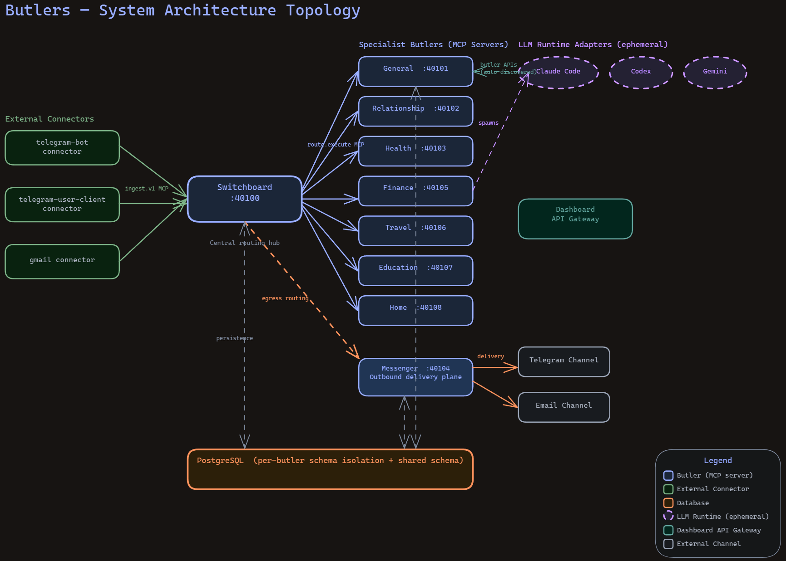
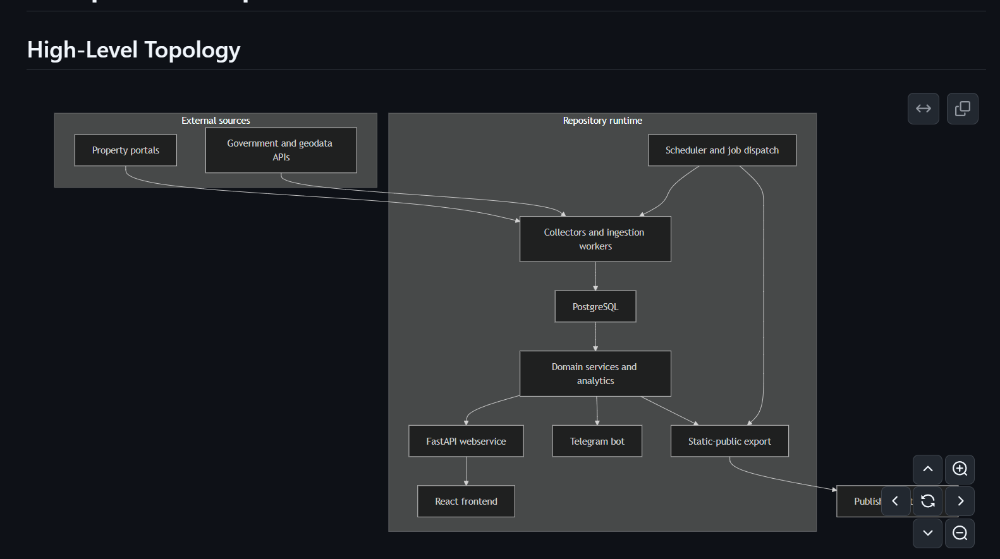

<Callout type="info">
This is a snapshot-type post, where I document the latest state of the personal tooling I maintain to aid my agentic development processes. I may update this over time as my tooling evolves.

Last updated: 2026-04-08
</Callout>

## The Goal

*Guiding principles for these concepts can be found in my sister post, [AI Economics Ruminations](/blog/ai-economics-ruminations)*

At a high level, the goal of this setup is simple: I want to be able to move between Claude Code, Codex, Gemini CLI, and OpenCode without feeling like I am re-teaching each tool how I work from scratch.

The naive way to do this is to let every tool accrete its own giant pile of prompts, instructions, local hacks, shell aliases, and one-off repos until the entire thing turns into a snowflake. That arrangement works only as long as the person who assembled it still remembers where everything is and why it was put there.

I wanted one place where the *operating model* lives, and then thin per-tool adapters around that model. The important bit here is that the reusable knowledge should outlive any given tool vendor, model generation, or plugin format. If Codex gets better next month, or Gemini adds a new affordance, I want to improve the adapter layer and keep moving.

That requirement ultimately pushed me towards a repo shape that is far more documentation-heavy than most dotfiles repos. The repo preserves a way of working.

## A Project's Shape: The Mandate of Alignment

When working with agentic workflows, keeping individual (and often unsupervised) agents aligned to our requirements often becomes the primary constraint. Divergent agents are often useless, or sometimes even actively harmful, to the rate of development of the project. Just to name a few instances:

- Agents outputting gibberish after ~400k tokens due to [context rot](https://github.com/chroma-core/context-rot) and [needle-in-haystack degradation](https://old.reddit.com/r/codex/comments/1rlyf98/1m_context_is_not_worth_it_seriously_the_quality/)
- A rogue agent once deleted my entire dev database while trying to re-bootstrap my docker-compose setup
- Agents working in the same git folder often liberally run destructive commands like `git stash` and `git reset --hard`; even with explicit instructions to work in their own worktrees
- Agents misunderstanding an intent can spawn *other agents* with the misunderstood intent, leading to a [broken telephone](https://en.wikipedia.org/wiki/Telephone_game) line of work that has to be entirely scrapped (if it can even be detected!)

I came up with two core ideas for tackling this over long contexts and multi-agent workflows:

**1. Working with the spirit and not the letter of the law**

Through my journey working with AIs so far, I've noticed several 'AI smells' that inherently contradict my own instincts for good and practical engineering.

*1. Liberal use of shims for preservation of backwards compatibility*

I've found that LLMs tend to over-respect [Hyrum's Law](https://www.abenezer.ca/blog/hyrum-law-in-golang); when a function is changed, it will often go to unreasoanble ends to ensure the 'previous shape' persists in the system, so nothing depending on it can break. This might provide short-term relief for maintainers; a release can't go wrong if all production dependencies are preserved, after all!

However, this pattern tends to cause the codebase to evolve into absolute gobbledegook over time. Some examples:

- Changing a function signature: For backwards compatibility, overload the method and preserve the old signature
- Changing a function location: For backwards compatibility, import and re-export the module from the old location
- Changing a module: Import and re-export everything via `__init__.py` tricks

These add *nothing* to the functionality of the code, and simply add to the unreadability, all in the name of stability. This is an example of respecting the *letter* of the law (existing import/export/dependency chains) rather than the *spirit* of the change (I want to refactor my module, and refactor all the imports too, damnit).

*2. Tests pass good, Tests fail bad. Do Anything To Make Tests Pass*

LLMs can take objective-driven approaches too far with its code. When its goal is simply 'Make our CI pass', it can resort to shims like *faking entire sets of data in the test suite* to make an integration or e2e test pass. They also often try to get around failing tests by testing for exact inputs and outputs, rather than understanding *why* a test was written. 

Getting an AI to understand the spirit and not the letter of the project is important, because it shapes the consideration going into every session of how it writes code. Emphasizing **why** a change needs to be made, because *this is what the project's goals are*, and this is **how** we want to do it, allows it to reason from first-principles of "Do the project *well*; subtask X is a requirement" instead of "Achieve subtask X by any means necessary".

**2. Specification Frameworks**

I have found [Spec Driven Development](https://en.wikipedia.org/wiki/Spec-driven_development) to be one of the most important parts of maintaining a large, growing, contextually difficult piece of code. Heavy engagement with LLMs on *specifications* allows us to thrash out lots of possible failure modes and misconceptions before they make it into concretized code. Wrongly aligned code can often have extremely tangled recovery processes; database schema decisions, or bad data in the system, can all have very, very difficult and messy recovery processes.

LLMs are fantastic at communication, great at incessant hammering away at a task, and good at brainstorming (within existing technical capabilities). All three lend to its capability of generating *human readable documentation* to mandate **what** an application needs, without any underlying code having been generated. This also allows me to hash out edge cases in what is essentially pseudocode, before we get down and dirty with technical details. Technical constraints are rarely hard constraints on functional requirements of a system; the implementation of the code hence rarely impacts the functionalities that we can achieve with simply our ideas. For use cases which require straining technical capabilities - low latency programming, for example - specifications can mandate latency, and THEN the code can be shaped to achieve said requirements.

**3. Mental Models**

 eventually evolved into being a central control center](butlers-dashboard-visibility.png)

With the absolute sheafs of code being written by LLMs, I have turned to LLMs to aid me in being able to keep updated mental models of the system in my head. This is an ongoing battle: As applications grow more complex, the UXes for understanding the code and the intermediate states of the system must evolve with them. I have found in my experiences that setting requirements for *code legibility, observability, and transparency*  have been critical in helping me to continue with keeping mental models of my systems in my head as a system runs day to day. **WHERE** is everything??

To achieve this, I created the concept of a [project-shape skill](https://github.com/Tzeusy/ai-bootstrap/blob/main/skills/personal/project-shape/SKILL.md), which serves to drive a spec-driven shape, or pillars underlying a project. I named the concepts normatively; hopefully in a self-explanatory way.

#### The Heart and Soul

The heart and soul of a project drives the underlying **doctrine**. Why does this project exist? What is the problem that we are trying to overcome? This pillar represents the manifesto and the mission statement of the repository; any changes made should be made in service of furthering that goal. This pillar takes precedence over everything else, as it is the ultimate boiled-down spirit of what the project is trying to achieve.

Having a LLM understand this allows it to make snap-judgements in its development process for decisions that lie *in favor* of solving the 'bigger picture' problem.

For this repo, the doctrine is basically: this is a **skills-first** system for portable AI-assisted development. Shared workflow logic belongs in `skills/`. My own local operating model belongs in `skills/personal/`. Tool namespaces like `.claude/`, `.codex/`, `.gemini/`, and `opencode/` exist as *thin adapters* around the canonical layer.

That sounds obvious when written down, but it matters a lot in practice. Without an explicit doctrine, every future change is incentivized to take the locally convenient route. Need a new workflow? Jam it into one tool's prompt. Need a workaround? Hand-edit the mirrored copy. Need some local state? Commit it and tell yourself you'll clean it up later. A month of that and the repo stops encoding principles and starts encoding accidents.

The "**heart and soul**" documents are there to make some rules non-negotiable:

- Reusable workflow logic is canonical in `skills/`
- Provenance should remain visible; upstream-derived skills should retain clear lineage
- Local runtime junk, caches, IDs, and secrets live outside the canonical repo surface
- A human or LLM should be able to answer "where does this belong?" without spelunking through six prompt files

This might sound a touch doctrinaire, but I think that is the correct stance. The whole point of doctrine is to be slightly annoying to violate.

#### The Law and Lore

Doctrine on its own is still too soft. "Skills-first" is a nice thesis, but it still leaves practical questions when a workflow can *almost* be shared except one tool needs extra metadata, or when a mirrored skill name loses its provenance because the installed namespace is flattened.

That is what the law-and-lore layer is for: it turns the spirit into **design contracts**. This means RFCs that explain the structural agreements the repository is expected to uphold. Which directories are canonical? Which ones are mirrors? When is tool-specific divergence legitimate? How do symlinks and home-directory installs work? What kind of runtime state is explicitly outside the contract?

I have found this to be unusually important with AI tooling because these ecosystems mutate very quickly. If there is no written contract, every new tool feature exerts pressure to reorganize the repo around itself. The law-and-lore docs keep the repository shape deliberate as adapters evolve with each vendor's affordances. The lore part of law-and-lore is effectively all the sharp edges that a future-me or future-agent would otherwise re-discover the hard way.

#### The Spec and Spine

The spec-and-spine layer answers the question: alright, if these doctrines and contracts are real, what must be true in a way that can be checked?

This is where `openspec/` comes in. I use it to turn a repository shape into normative requirements and change records instead of leaving it as aspirational prose. A proposal says *why* a structural change is happening. A design doc says *how* it is intended to work. The spec says what properties must hold if the repository is still considered coherent afterwards.

I like this separation because it prevents a common failure mode in AI-assisted development: a repository can feel well-explained while still being underspecified. Everyone "gets the idea", until six weeks later the implementation has drifted and nobody can say whether the current shape is still valid or merely familiar.

OpenSpec gives me something more concrete:

- `proposal.md` records why a change exists
- `design.md` records the shape of the solution
- `tasks.md` captures the implementation trail
- the spec itself turns all of that into auditable requirements

In other words, the spine is what prevents the whole setup from becoming vibes-driven architecture. If doctrine is the ethos and RFCs are the contracts, the spec layer is the point where the repo can finally say "this is what counts as correct".

#### The Lay and Land

The final pillar is topology: **where** everything lives, and how it all connects.

This is arguably the pillar that saves the most cognitive load day to day. A multi-tool AI setup can accumulate a truly irritating number of surfaces: canonical skill sources, tool-specific mirrors, checked-in defaults, ignored local runtime state, installation targets under `$HOME`, helper scripts, legacy agent prompts, and generated artifacts. Without a topology map, the whole thing quickly becomes the sort of system where every answer starts with "it depends what you mean by source of truth".

The lay-and-land docs are my answer to that. They map the repo as a set of layers:

- shared authoring in `skills/`
- local workflow customization in `skills/personal/`
- older prompt corpora in `agents/`
- thin tool facades in `.claude/`, `.codex/`, `.gemini/`, and `opencode/`
- self-knowledge in `about/`
- normative requirements in `openspec/`

Just as importantly, they describe the flow: author canonical assets in the repo, mirror or link them into tool-specific surfaces, then install those surfaces into the actual homes each assistant consumes. Once that is written down, it becomes much easier to resist doing silly things like editing a mirrored copy and forgetting that the real source lives elsewhere.

This pillar also cross-cuts the others. Doctrine tells me why the setup exists. Law-and-lore tells me the rules for evolving it. Spec-and-spine tells me what must remain true. Lay-and-land tells me where to put my hands when I actually want to change something.

## Delivery: The Orchestra of Work

Funnily, this was actually how I started on my journey of LLM CLIs: I read about Steve Yegge's [Gas Town](https://steve-yegge.medium.com/welcome-to-gas-town-4f25ee16dd04) on a plane and spent the flight thinking about the multiplicative implications. The motive here is simple: we have a ridiculously powerful LLM at our fingertips, and it's doing really well with *one of me*; how do I run multiple copies of the LLM, while keeping one of me, while keeping everything logically consistent, without having them step on each others' toes?

<Callout type="warning">Steve isn't joking when he says Gas Town is a massive token guzzler; I tried Gas Town for a week or so, but quickly realized it was exhausting my budget far faster for much less output-per-token than my own self-rolled orchestration workflows. It's probably more productive overall; but it was overwhelming my Claude Max 20x + Codex Pro subscriptions, and I felt that $600 a month was already too much to pay as an individual :-).</Callout>

Given that I wasn't going to spend more than $600 a month on personal AI (and in a period of work, only intending to spend $300/month), I had to figure out how to roll my own orchestration stack, that's hopefully a bit more efficient. As it turns out, most of the components involved here are already solved problems in existing systems today.

- Running multiple LLMs is trivialized with terminal tools like `tmux`; getting one LLM to run other LLMs was supported in mid-2025 for Claude, 2026 for Codex.
- Task ordering is solved with [Directed acyclic graphs](https://en.wikipedia.org/wiki/Directed_acyclic_graph) in job schedulers like Airflow, as long as we can figure out a reliable way to chain dependent jobs
- Giving agents dedicated playgrounds is solved by [git worktrees](https://git-scm.com/docs/git-worktree)

Primitive implementations for getting orchestration working with agents is simply a task of wiring up implementations of all of the abovementioned concepts in the right order. There are several problems that we can additionally explore:

- Model tiers for different subagents for tasks of different complexity (worst case; run everything with Opus, hah)
- Reconciliation tasks to valid the outputs of unsupervised agents
- PR review workflows for additional code safety

But none of those are inherently *blockers*; more of implementation details.

#### The Coordinator

Once the repository shape was settled, the next question was how to actually *operate* within it.

This is where I split "direction" from "delivery". The [`project-direction`](https://github.com/Tzeusy/ai-bootstrap/blob/main/skills/personal/project-direction/SKILL.md) skill is responsible for deciding what the project should work on next: reconcile doctrine, reconcile specs, synthesize a coherent OpenSpec change, and then generate an acyclic beads graph. Its output is an execution-ready plan.

That handoff goes to [`beads-coordinator`](https://github.com/Tzeusy/ai-bootstrap/blob/main/skills/personal/beads-coordinator/SKILL.md). The coordinator is the live execution layer. It runs cleanup, looks at `bd ready`, selects the highest-priority unblocked work, creates isolated worktrees, and dispatches exactly the right worker for the bead in front of it. If there is a waiting PR-review bead, that lane takes precedence. If there is simple direct-merge work, it handles that path too. Its scope is orchestration.

I like this split because it prevents planning from getting contaminated by execution convenience. The directioning layer asks "what is coherent, aligned, and worth doing?" The coordinator asks "given that plan, what can safely move right now?" They are related questions with different responsibilities.

#### The Worker

[`beads-worker`](https://github.com/Tzeusy/ai-bootstrap/blob/main/skills/personal/beads-worker/SKILL.md) is deliberately much narrower. A worker gets one bead, one branch, one worktree, and one bounded objective. It stays inside that issue boundary, implements the change, runs the quality gates, and hands back a structured report.

That constrained contract matters a lot. It means the implementation agent is optimized for delivery. The worker can read Beads state for context, while the coordinator owns lease renewal, dependency wiring, blocker creation, PR-review bead creation, and closure. The workflow stays legible because each role has a sharp boundary.

This is also where the worktree discipline earns its keep. Every file read, edit, test run, commit, push, and PR command happens inside the worker's isolated checkout. That one rule eliminates an enormous amount of cross-agent foot-gunning. The worker is meant to be boring in the best possible way: scoped, verifiable, and hard to confuse with a free-roaming coding session.

#### The Reviewer

The reviewer exists because unsupervised throughput without skepticism is just accelerated entropy.

In the Beads model, that role is handled by [`beads-pr-reviewer-worker`](https://github.com/Tzeusy/ai-bootstrap/blob/main/skills/personal/beads-pr-reviewer-worker/SKILL.md), which is dispatched only for dedicated `pr-review-task` beads. It has a stricter job: identify the original implementation bead, resolve the linked PR, rebase it onto the latest base branch, inspect unresolved review threads and code deltas, apply or request fixes, and only merge if a fairly hard set of guards passes.

Those guards are the kind I want a reviewer to care about and an implementer to be slightly annoyed by: the PR is ready for merge, unresolved review threads are zero, required checks are green, merge state is clean enough, and the review leaves a visible audit trail. Otherwise, the reviewer keeps the review bead blocked and the system goes around again.

I have become increasingly convinced that this separation is mandatory once multi-agent work enters the picture. A worker is optimized to finish a scoped implementation bead. A reviewer is optimized to decide whether that work is actually mergeable. Those are different instincts, and the more explicit I make that difference in the operating model, the less likely I am to confuse throughput with correctness.

## Miscellaneous High-Value Capabilities

### Diagramming: Excalidraw

One of the highest-leverage auxiliary capabilities in the setup is diagramming, specifically around Excalidraw.

As code generation gets cheaper, understanding systems becomes the more precious resource. I have found that a good architecture diagram, topology map, or flow sketch often collapses pages of prose into something an agent can reason about in one glance. This is especially true for project-shape work, where much of the challenge is not implementation difficulty but preserving a coherent mental model across doctrine, contracts, requirements, and topology.

So I treat diagramming as part of the workflow layer. If a system shape is important enough to be load-bearing, it is often important enough to draw.
